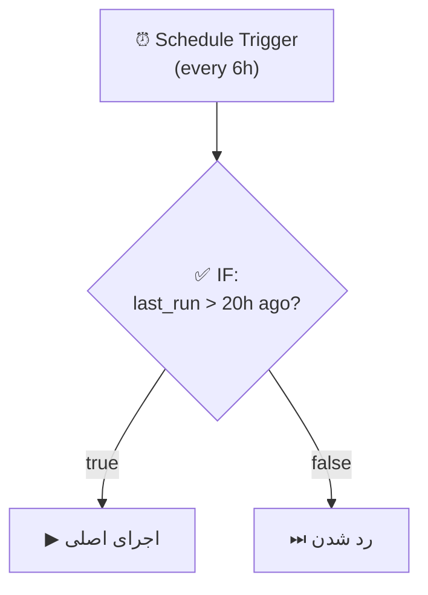

# Pattern: Scheduling — زمان‌بندی و کرون جاب

> Technique key: `scheduling`
> اجرای خودکار taskها در زمان مشخص — کرون جاب، تأخیر، تایمر

---

## ۱. معرفی

ورک‌فلوهای زمان‌بندی شده برای کارهایی که باید **خودکار و تکراری** یا **در زمان مشخص** اجرا بشن.

**موارد استفاده:**
- گزارش‌های روزانه/هفتگی
- پاکسازی داده (data cleanup, session TTL)
- Notificationهای زمان‌بندی شده
- Sync بین Data Table و PostgreSQL
- یادآوری به کاربران

---

## ۲. Schedule Trigger — زمان‌بندی تکراری

> نود: `n8n-nodes-base.scheduleTrigger` (v1.3)

### دو حالت اصلی:

| حالت | توضیح | مناسب برای |
|------|-------|-----------|
| **Interval** | تنظیمات آماده با dropdown | کرون ساده: هر X دقیقه، روزانه ساعت Y |
| **Cron Expression** | فرمت ۵ یا ۶ فیلدی | الگوهای پیچیده: دوشنبه‌ها ۹ صبح، آخر هر ماه |

### پارامترها:

| فیلد | Interval | Cron Expression |
|------|----------|----------------|
| `field` | seconds, minutes, hours, days, weeks, months | `cronExpression` |
| `secondsInterval` | ۱-۵۹ | — |
| `minutesInterval` | ۱-۵۹ | — |
| `hoursInterval` | ۱-۲۳ | — |
| `daysInterval` | ۱-۳۱ | — |
| `weeksInterval` | ۱+ | — |
| `monthsInterval` | ۱+ | — |
| `triggerAtHour` | ۰-۲۳ | — |
| `triggerAtMinute` | ۰-۵۹ | — |
| `triggerAtDay` | ۰ (Sun) - ۶ (Sat) | — |
| `triggerAtDayOfMonth` | ۱-۳۱ | — |
| `expression` | — | Cron |

### نکات Cron:

```
فرمت ۵ فیلدی:  [Minute] [Hour] [DayOfMonth] [Month] [DayOfWeek]
فرمت ۶ فیلدی:  [Second] [Minute] [Hour] [DayOfMonth] [Month] [DayOfWeek]

مثال‌ها:
0 9 * * 1       ← هر دوشنبه ساعت ۹:۰۰ (۵ فیلدی)
0 0 9 * * 1     ← هر دوشنبه ساعت ۹:۰۰ (۶ فیلدی با ثانیه)
*/5 * * * *     ← هر ۵ دقیقه
0 0 1 * *       ← اول هر ماه
0 0 * * 0       ← یکشنبه‌ها نیمه‌شب
```

> برای کرون ساده از **Interval Mode** استفاده کن. خواناتر و کم‌خطاتر.

### چندین Trigger Rule:

می‌تونی توی یه Schedule Trigger چند rule بذاری:

```
Rule 1: روزانه ساعت ۰۹:۰۰ (اخبار صبح)
Rule 2: روزانه ساعت ۲۱:۰۰ (خلاصه شب)
```

---

## ۳. Wait Node — تأخیر و انتظار

> نود: `n8n-nodes-base.wait` (v1.1)

### چهار حالت (resume):

| حالت | توضیح | خروجی |
|------|-------|-------|
| **timeInterval** | منتظر بمون برای X ثانیه/دقیقه/ساعت/روز | ادامه خودکار |
| **specificTime** | تا زمان مشخص صبر کن | ادامه خودکار |
| **webhook** | منتظر یک webhook call بمون | ادامه با داده webhook |
| **form** | منتظر پر کردن فرم توسط کاربر | ادامه با داده فرم |

### نکات مهم:

| نکته | توضیح |
|------|-------|
| **منطقه زمانی** | Wait از Server Time استفاده می‌کنه، نه workflow timezone |
| **بیش از ۲۴ ساعت** | از Data Table استفاده کن (زمان رو ذخیره کن، هر از گاهی چک کن) |
| **بیش از ۷ روز** | از polling استفاده کن، نه Wait |
| **resumeUrl** | توی `$execution.resumeUrl` می‌تونی URL رو بگیری |
| **webhookSuffix** | برای چند Wait توی یه workflow، suffix بذار |

---

## ۴. Conditional Scheduling — زمان‌بندی شرطی

به جای کرون پیچیده، از IF/Switch بعد از Schedule Trigger استفاده کن:



### نمونه‌ها:

```
چهارشنبه آخر ماه؟  ← IF: {{ $now.day === $now.endOf('month').day }}
امروز تعطیله؟      ← IF: Data Table holiday list
صبح یا عصر؟         ← SWITCH: {{ $now.hour }}
روز هفته یا آخر هفته؟ ← SWITCH: {{ $now.weekday }}
```

---

## ۵. معماری پایه

### کرون ساده:
```
[Schedule Trigger]
    ↓
[نود اصلی (AI Agent / Data / API)]
    ↓
[Notification / ذخیره‌سازی]
```

### کرون شرطی:
```
[Schedule Trigger (هر ۴ ساعت)]
    ↓
[IF: آیا زمانش هست؟] ── false ──► [End]
    ↓ true
[نود اصلی]
```

### Polling با Data Table:
```
[Schedule Trigger (هر ساعت)]
    ↓
[Data Table: GET pending]
    ↓
[IF: pending > 0?] ── false ──► [End]
    ↓ true
[Processing]
```

### Catch-up بعد از Downtime:
```
[Schedule Trigger (هر ۴ ساعت)]
    ↓
[Data Table: GET last_run_time]
    ↓
[IF: NOW - last_run > 20h?] ── false ──► [End]
    ↓ true
[run processing]
[Data Table: UPDATE last_run_time]
```

---

## ۶. Data Table برای مدیریت وضعیت کرون

برای کارهای پیشرفته زمان‌بندی، از Data Table استفاده کن:

| سناریو | Data Table | فیلدها |
|--------|-----------|--------|
| **Catch-up** | `cron_state` | last_run_at, workflow_name |
| **Queue** | `pending_tasks` | task_id, scheduled_at, status |
| **Mutex** | `cron_locks` | workflow_id, running_flag, started_at |
| **Holidays** | `holidays` | date, description |

### Mutex برای جلوگیری از Overlap:

```
[Start] → [Data Table: UPDATE running_flag=1 WHERE running_flag=0]
    ↓ IF affected_rows=0 → [Skip (قبلاً در حال اجراست)]
    ↓ IF affected_rows=1 → [اجرای اصلی]
    ↓ [Data Table: UPDATE running_flag=0]
```

---

## ۷. Workflowهای زمان‌بندی شده رایج در پروژه فروشگاهی

### ۱. Cache Sync
```
Schedule Trigger (هر ۵ دقیقه)
  → PostgreSQL: SELECT * FROM products WHERE is_active=true
  → Data Table: TRUNCATE products_cache
  → Data Table: INSERT INTO products_cache (rows)
```

### ۲. Session Cleanup
```
Schedule Trigger (هر ۶ ساعت)
  → Data Table: DELETE FROM user_sessions WHERE updated_at < NOW() - 24h
```

### ۳. Order Delinquent Transfer
```
Schedule Trigger (هر ساعت)
  → Data Table: SELECT FROM orders_cache WHERE created_at < NOW() - 24h
  → PostgreSQL: INSERT INTO orders (..., status='delinquent')
  → Data Table: DELETE FROM orders_cache
  → Telegram: یادآوری به کاربر
```

### ۴. Daily Report
```
Schedule Trigger (روزانه ساعت ۰۹:۰۰)
  → PostgreSQL: گزارش فروش دیروز
  → AI Agent: خلاصه گزارش
  → Telegram: ارسال به ادمین
```

---

## ۸. نودهای معرفی شده

| نود | کاربرد |
|-----|--------|
| `scheduleTrigger` | کرون جاب اصلی (Interval / Cron) |
| `wait` | تأخیر، انتظار برای webhook/form |
| `if` | شرط‌های زمانی (آخر ماه، روز تعطیل) |
| `switch` | مسیریابی بر اساس زمان (صبح/عصر، روز/شب) |
| `dataTable` | ذخیره وضعیت کرون، queue، mutex |
| `code` | منطق پیشرفته کرون (اگه set/if کافی نباشه) |
| `postgres` | گزارش‌گیری، sync به Data Table |

---

## ۹. خطاهای رایج

### 🕳️ Missed Schedules During Downtime
اگه n8n down باشه، triggerها از دست میرن. هیچ catch-up خودکاری نداره.
**راه‌حل:** idempotent workflow با last_run_time توی Data Table.

### 🕳️ Overlapping Executions
ورک‌فلو ۱۰ دقیقه‌ست، ولی trigger هر ۵ دقیقه می‌زنه.
**راه‌حل:** Mutex با Data Table یا افزایش فاصله trigger.

### 🕳️ Wait Node Timezone
Wait از Server Time استفاده می‌کنه نه workflow timezone.
**راه‌حل:** از relative duration استفاده کن ("wait 2 hours") به جای absolute time.

### 🕳️ Cron همیشه تکرار میشه
`0 12 22 10 *` برای ۲۲ اکتبر — هر سال تکرار میشه!
**راه‌حل:** از Wait برای یکبار مصرف استفاده کن.

### 🕳️ First Execution Timing
اولین اجرا بعد از activate شدن، ممکنه با چیزی که انتظار داری فرق کنه.
**راه‌حل:** manual execution بزن برای اولین بار.

---