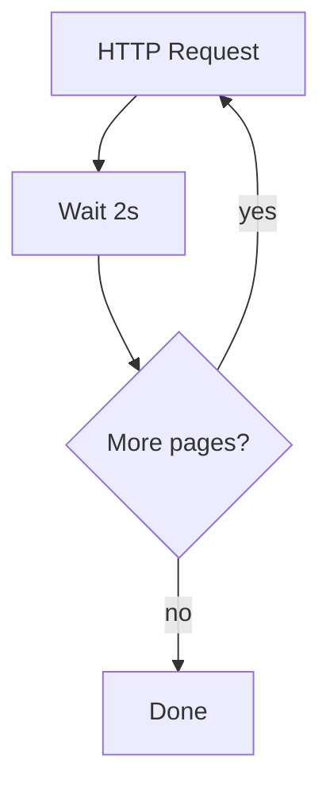
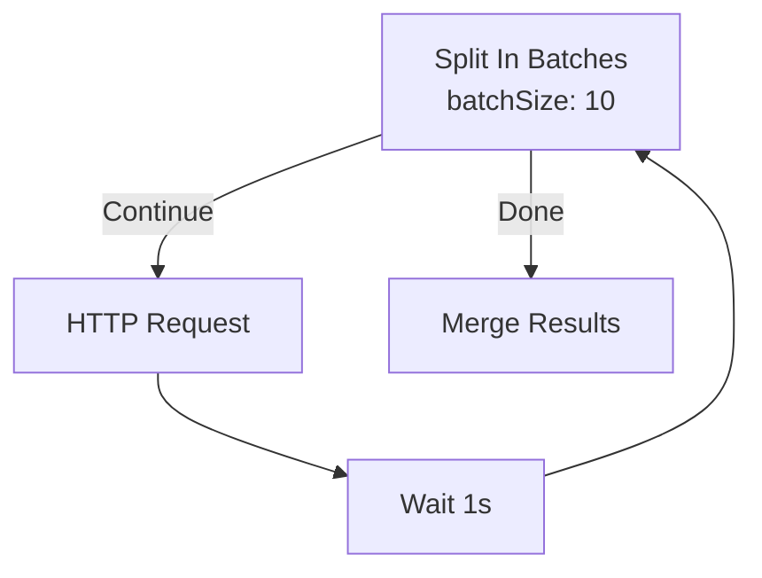
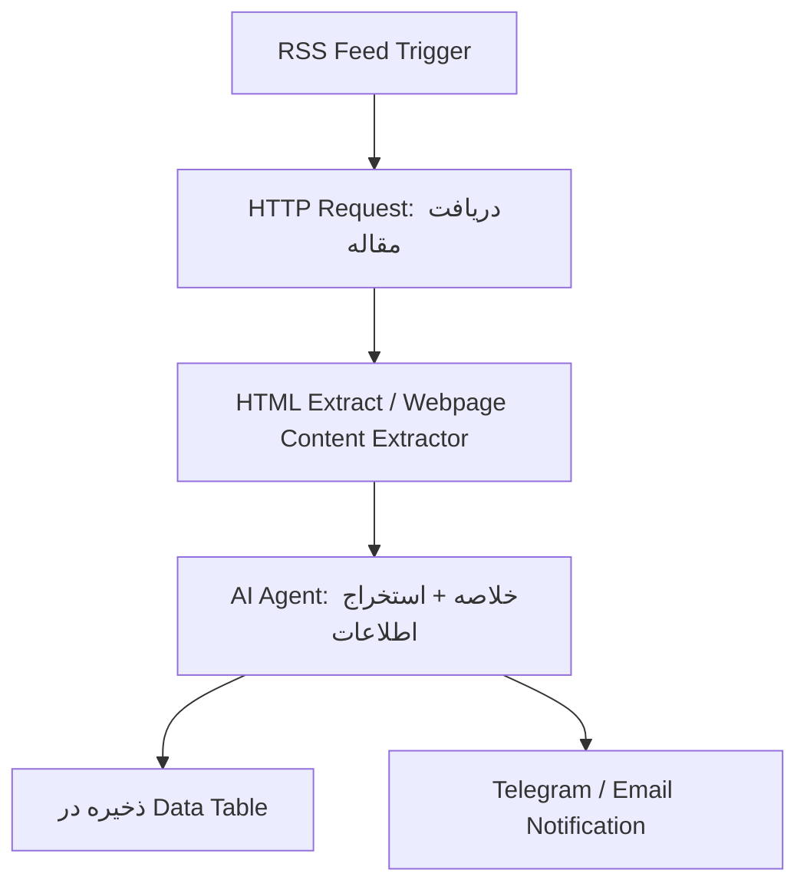
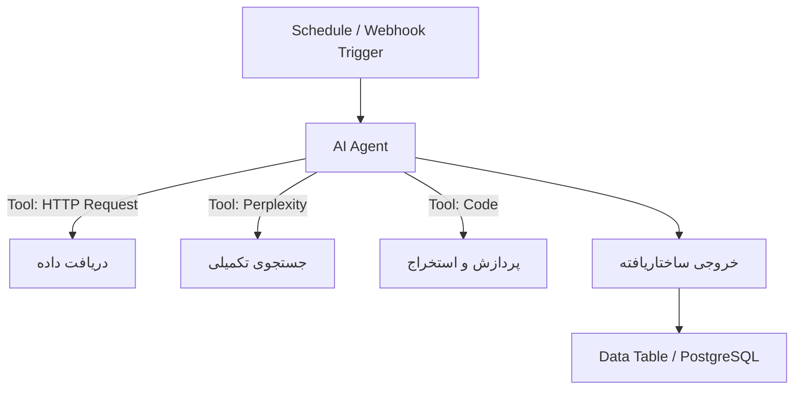
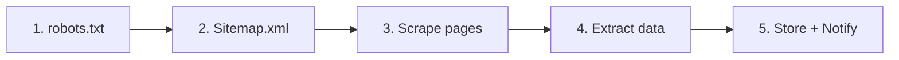

# Pattern: Scraping & Research — اسکرپینگ و تحقیقات وب

> Technique key: `scraping_and_research`
> جمع‌آوری اطلاعات از وب‌سایت‌ها و APIها — از یک URL ساده تا اسکرپینگ پیشرفته با AI Agent

---

## ۱. معرفی

دو رویکرد اصلی:

| رویکرد | توضیح | ابزارها |
|--------|-------|---------|
| **HTTP Scraping** | دریافت مستقیم HTML/JSON و استخراج داده | HTTP Request, HTML Extract, RSS, Webpage Content Extractor |
| **Agent Scraping** | استفاده از AI Agent برای تصمیم‌گیری و استخراج هوشمند | AI Agent, Perplexity, Apify, Information Extractor |

---

## ۲. HTTP Request — قلب اسکرپینگ

> نود: `n8n-nodes-base.httpRequest` (v4.3)

### پارامترهای اصلی:

| پارامتر | توضیح |
|---------|-------|
| `method` | GET / POST / PUT / PATCH / DELETE / HEAD / OPTIONS |
| `url` | آدرس مقصد (اجباری) |
| `authentication` | `none` / `predefinedCredentialType` / `genericCredentialType` |

### روش‌های احراز هویت (genericAuthType):

| نوع | توضیح | مثال |
|-----|-------|------|
| `httpBearerAuth` | Bearer Token | `Authorization: Bearer <token>` |
| `httpHeaderAuth` | هدر سفارشی | `X-API-Key: ...` |
| `httpQueryAuth` | API Key در query string | `?api_key=...` |
| `httpBasicAuth` | username + password | `Authorization: Basic ...` |
| `httpCustomAuth` |完全 custom | ساختار دلخواه |
| `oAuth2Api` | OAuth 2.0 | — |

> ⚠️ **نکات امنیتی:** هیچوقت API key یا توکن رو مستقیم توی headerParameters یا queryParameters نذار. همیشه از credential system استفاده کن.

### Query Parameters:

```json
{
  "sendQuery": true,
  "queryParameters": {
    "parameters": [
      { "name": "page", "value": "1" },
      { "name": "limit", "value": "50" }
    ]
  }
}
```

### Headers:

```json
{
  "sendHeaders": true,
  "headerParameters": {
    "parameters": [
      { "name": "Accept", "value": "application/json" },
      { "name": "User-Agent", "value": "Mozilla/5.0 ..." }
    ]
  }
}
```

### Response Options:

| گزینه | توضیح |
|-------|-------|
| `fullResponse` | برگردوندن header + status code به همراه body |
| `neverError` | خطا نگیر روی status code غیر 2xx |
| `responseFormat` | `autodetect` / `file` / `json` / `text` |
| `outputPropertyName` | اسم خاصیت خروجی برای binary/text response |

### Redirects:

```json
{
  "redirect": {
    "redirect": {
      "followRedirects": true,
      "maxRedirects": 21
    }
  }
}
```

### Timeout:

پیش‌فرض ۱۰ ثانیه — برای سایت‌های سنگین بیشتر کن:
```json
{
  "timeout": 30000
}
```

### نکات مهم:

- **User-Agent** بعضی سایت‌ها درخواست بدون User-Agent رو بلاک می‌کنن
- **neverError** برای APIهایی که خطا رو توی body برمیگردونن نه status code
- **Timeout** برای سایت‌های کند حتماً زیادتر کن (مثل ۳۰-۶۰ ثانیه)
- **redirect.followRedirects** برای سایت‌هایی که ریدایرکت می‌کنن فعال کن

---

## ۳. Built-in Pagination — صفحه‌بندی توکار HTTP Request

> نیازی به Split In Batches دستی نیست! خود HTTP Request سه حالت صفحه‌بندی داره:

### حالت ۱: updateAParameterInEachRequest (رایج)

هر درخواست یه پارامتر رو آپدیت می‌کنه (مثل page number):

```json
{
  "pagination": {
    "pagination": {
      "paginationMode": "updateAParameterInEachRequest",
      "parameters": {
        "parameters": [
          {
            "type": "qs",
            "name": "page",
            "value": "={{ $response.headers?.['x-next-page'] || $page + 1 }}"
          }
        ]
      },
      "paginationCompleteWhen": "responseIsEmpty",
      "requestInterval": 1000,
      "maxRequests": 50
    }
  }
}
```

| پارامتر | توضیح |
|---------|-------|
| `type` | `qs` (query string), `body`, `headers` |
| `name` | اسم پارامتر (مثلاً `page`, `offset`, `cursor`) |
| `value` | expression — می‌تونی از `$response` و `$page` استفاده کنی |
| `paginationCompleteWhen` | `responseIsEmpty` / `receiveSpecificStatusCodes` / `other` |
| `requestInterval` | ms بین درخواست‌ها (rate limiting) |
| `maxRequests` | حداکثر تعداد درخواست |

### حالت ۲: responseContainsNextURL

API خودش URL صفحه بعد رو توی response برمیگردونه:

```json
{
  "pagination": {
    "pagination": {
      "paginationMode": "responseContainsNextURL",
      "nextURL": "={{ $json.next_page_url }}"
    }
  }
}
```

### حالت ۳: off

بدون صفحه‌بندی — خودت با Split In Batches هندل کن.

---

## ۴. Rate Limiting & Batching — کنترل نرخ درخواست

### روش ۱: Batching داخلی HTTP Request

```json
{
  "options": {
    "batching": {
      "batch": {
        "batchSize": 10,
        "batchInterval": 2000
      }
    }
  }
}
```

| پارامتر | توضیح |
|---------|-------|
| `batchSize` | هر بار چند آیتم پردازش بشه (پیش‌فرض ۵۰) |
| `batchInterval` | ms بین batchها (پیش‌فرض ۱۰۰۰) |

### روش ۲: Retry on Fail

توی تنظیمات نود HTTP Request می‌تونی `Retry on Fail` رو فعال کنی — برای زمان 429 یا خطاهای موقت.

### روش ۳: Wait Node بین درخواست‌ها



### روش ۴: Split In Batches + Wait



| پارامتر Split In Batches | توضیح |
|------------------------|-------|
| `batchSize` | تعداد آیتم در هر batch (پیش‌فرض ۱۰) |
| options.reset | ریست کردن state برای اجرای مجدد |

> خروجی اول (index 0) = Done, خروجی دوم (index 1) = Continue

---

## ۵. HTML Extraction — استخراج از HTML

دو نود برای استخراج از HTML:

### ۵.۱ HTML Extract (n8n-nodes-base.htmlExtract) v1

نود ساده و مخصوص — فقط یه URL می‌گیره و با CSS selector استخراج می‌کنه.

**پارامترها:**
| پارامتر | توضیح |
|---------|-------|
| `url` | آدرس صفحه |
| `extractionValues` | آرایه‌ای از key + cssSelector |

**محدودیت:** سایت‌های JS-rendered (React, Vue, etc.) رو نمی‌تونه بخونه — اون مواقع از Apify یا Webpage Content Extractor استفاده کن.

### ۵.۲ HTML Node (n8n-nodes-base.html) v1.2

نود کاملتر با سه عملیات:

| operation | توضیح |
|-----------|-------|
| `generateHtmlTemplate` | تولید HTML (مثل ایمیل یا گزارش) |
| `extractHtmlContent` | استخراج داده از HTML با CSS selector |
| `convertToHtmlTable` | تبدیل JSON به جدول HTML |

**extractionValues جزئیات:**

```json
{
  "extractionValues": {
    "values": [
      {
        "key": "title",
        "cssSelector": "h1.product-title",
        "returnValue": "text",
        "returnArray": false
      },
      {
        "key": "price",
        "cssSelector": "span.price",
        "returnValue": "text",
        "returnArray": false
      },
      {
        "key": "images",
        "cssSelector": "img.gallery-image",
        "returnValue": "attribute",
        "attribute": "src",
        "returnArray": true
      }
    ]
  }
}
```

| `returnValue` | توضیح |
|--------------|-------|
| `text` | متن داخل المان |
| `html` | HTML داخل المان |
| `attribute` | مقدار یک attribute (با `attribute` مشخص می‌شه) |
| `value` | مقدار input field |

**Options:**
| گزینه | توضیح | پیش‌فرض |
|-------|-------|---------|
| `trimValues` | حذف فاصله اضافه | true |
| `cleanUpText` | فشرده‌سازی whitespace | true |
| `capitalize` | بزرگ کردن حروف | false |

### ۵.۳ Webpage Content Extractor

> نود: `n8n-nodes-webpage-content-extractor.webpageContentExtractor` (v1)

مثل حالت Reader مرورگر کار می‌کنه — header, footer, banner رو حذف می‌کنه و فقط محتوای اصلی رو برمیگردونه.

**کی استفاده کنیم:** وقتی فقط «متن اصلی» یه صفحه رو می‌خوای — مقالات، بلاگ پست‌ها، documentation.

---

## ۶. استخراج از XML / Sitemap / robots.txt

### robots.txt

با HTTP Request بگیر و خودت parse کن:

```
HTTP Request → GET https://example.com/robots.txt
    ↓
Code (JS) → parse خطوط: Sitemap: ...
    ↓
HTTP Request → GET sitemap.xml
```

### Sitemap XML

sitemapهای XML با HTTP Request قابل گرفتن هستن:

```
HTTP Request → GET https://example.com/sitemap.xml
    ↓
Code → parse XML (چون sandbox هست، از regex یا parse ساده استفاده کن)
    ↓
HTTP Request → scrape pages
```

> ⚠️ **محدودیت Code Node:** توی sandbox نمیشه از `fetch`, `axios`, `requests` استفاده کرد. ولی `DOMParser` و `JSON.parse` و regex کار می‌کنه.

### Extract from File (XML)

> نود: `n8n-nodes-base.extractFromFile` (v1.1) با operation: `xml`

اگه فایل XML به صورت binary داری، این نود می‌تونه parse کنه.

---

## ۷. RSS Feed — خوراک خبری

> نود: `n8n-nodes-base.rssFeedRead` (v1.2)

ساده و کاربردی برای مانیتور کردن وبلاگ‌ها، خبرگزاری‌ها، پادکست‌ها:

| پارامتر | توضیح |
|---------|-------|
| `url` | آدرس RSS feed |
| options.customFields | فیلدهای اضافی مثل `author, contentSnippet` |
| options.ignoreSSL | نادیده گرفتن SSL issues |

**Trigger variants:**
- `rssFeedReadTool` — برای استفاده در AI Agent به عنوان tool
- `rssFeedReadTrigger` —トリガー برای شروع workflow به محض آپدیت شدن RSS

**معماری مانیتورینگ RSS:**



---

## ۸. Apify — اسکرپینگ حرفه‌ای

> نود: `@n8n/mcp-registry.apify` (v1.1)

**کی استفاده کنیم:**
- سایت‌های JS-heavy (SPA, React, Vue)
- سایت‌هایی که بلاک می‌کنن (LinkedIn, Instagram, Twitter)
- گرفتن اسکرین‌شات
- استخراج ساختاریافته از سایت‌های پیچیده

**نکات:**
- دو نسخه وجود داره: Apify MCP (AI Agent-ready) و HTTP Request به Apify API
- برای AI Agent از MCP variant استفاده کن — tools رو به شکل درست expose می‌کنه
- Apify Actors هزاران سناریوی آماده دارن

**معماری:**
```
[Schedule Trigger]
    ↓
[Apify Actor: scrape target site]
    ↓
[Data Table / PostgreSQL: ذخیره]
    ↓
[AI Agent: تحلیل داده‌ها]
    ↓
[Notification]
```

---

## ۹. Perplexity — جستجوی هوشمند

> نود: `n8n-nodes-base.perplexity` / `perplexityTool` (v2)

چهار resource:

| resource | operation | توضیح |
|----------|-----------|-------|
| `search` | `search` | جستجوی خام وب با ranking و فیلتر |
| `chat` | `complete` | مکالمه با Sonar models + web search توکار |
| `agent` | `createResponse` | Agent API با third-party models و tools |
| `embedding` | `createEmbedding` | تولید vector embedding |

**کی استفاده کنیم:** وقتی نیاز به جستجوی به‌روز داری ولی نمی‌خوای خودت scrape کنی.

---

## ۱۰. LLM-powered — استخراج هوشمند با AI

### ۱۰.۱ Information Extractor

> نود: `@n8n/n8n-nodes-langchain.informationExtractor` (v1.2)

از LLM برای استخراج ساختاریافته استفاده می‌کنه. بهت schema می‌دی، LLM پر می‌کنه.

**سه روش تعریف schema:**

| `schemaType` | توضیح |
|-------------|-------|
| `fromAttributes` | ساده — اسم فیلد + type + description |
| `fromJson` | با یه JSON example — خودش schema رو حدس می‌زنه |
| `manual` | JSON Schema کامل |

**نمونه with fromAttributes:**
```json
{
  "text": "={{ $json.content }}",
  "schemaType": "fromAttributes",
  "attributes": {
    "attributes": [
      { "name": "product_name", "type": "string", "description": "اسم محصول" },
      { "name": "price", "type": "number", "description": "قیمت به تومان" },
      { "name": "in_stock", "type": "boolean", "description": "موجود است؟" }
    ]
  }
}
```

**Batching options:**
```json
{
  "batching": {
    "batchSize": 5,
    "delayBetweenBatches": 200
  }
}
```

> نیاز به یه Language Model (مثل OpenAI, Anthropic) به عنوان subnode داره.

### ۱۰.۲ AI Agent

> نود: `@n8n/n8n-nodes-langchain.agent` (v3.1)

برای سناریوهای پیشرفته — Agent می‌تونه تصمیم بگیره چطور scrape کنه:

**ابزارهای مفید برای scraping:**
- HTTP Request Tool
- RSS Read Tool
- Perplexity Tool
- Apify MCP
- Code Tool
- Vector Store Tool (برای جستجوی دانش قبلی)

**معماری Agent Scraper:**


### ۱۰.۳ Summarize / Item Lists

> نود: `n8n-nodes-base.summarize` (v1.1) — جمع‌آوری عددی (sum, count, avg, min, max)
> نود: `n8n-nodes-base.itemLists` (v3.1) — عملیات پیشرفته روی لیست‌ها

**Item Lists operations:**

| operation | توضیح |
|-----------|-------|
| `concatenateItems` | ترکیب فیلدها در یک آیتم |
| `limit` | محدود کردن تعداد آیتم‌ها |
| `removeDuplicates` | حذف تکراری‌ها |
| `sort` | مرتب‌سازی |
| `splitOutItems` | تبدیل آرایه به آیتم‌های جدا |
| `summarize` | Pivot table (aggregate) |

---

---

> 💡 **Error Handling Patterns رو توی فایل جداگانه ببین: [`18-error-handling.md`](./18-error-handling.md)**

## ۱۲. Code Node — نکات حیاتی

> نود: `n8n-nodes-base.code` (v2) 

### ⚠️ محدودیت‌های اساسی:

| محدودیت | توضیح |
|---------|-------|
| **🚫 No Network** | `fetch()`, `axios`, `XMLHttpRequest` — همه fail می‌شن |
| **🚫 No File System** | نمی‌تونی فایل بخونی/بنویسی |
| **🚫 Sandboxed** | منابع محدود، برای دیتاست بزرگ از Batch استفاده کن |

### کی استفاده کنیم (و کی نکنیم):

| ✅ مناسب | ❌ نالایق |
|---------|-----------|
| پردازش داده با منطق پیچیده | هر چیزی که Set/IF/Switch انجام بده |
| parse کردن فرمت خاص | درخواست HTTP/API |
| validation سفارشی | عملیات سنگین روی دیتاست بزرگ |
| ترکیب چندتا شرط | کار با فایل (از Read/Write File استفاده کن) |

### دو mode:

| mode | توضیح |
|------|-------|
| `runOnceForAllItems` | یک بار برای همه آیتم‌ها اجرا می‌شه |
| `runOnceForEachItem` | به تعداد آیتم‌ها اجرا می‌شه |

### نمونه JS — parse کردن sitemap XML:

```javascript
// sitemap.xml رو parse کن
const xml = $input.first().json.body;
const urls = xml.match(/<loc>(.*?)<\/loc>/g)
  .map(u => u.replace(/<\/?loc>/g, ''));
return urls.map(url => ({ url }));
```

---

## ۱۳. رایج‌ترین معماری‌ها

### معماری ۱: Scrape ساده یه صفحه

```
[Schedule Trigger / Manual]
    ↓
[HTTP Request: GET https://example.com]
    ↓
[HTML Extract / Webpage Content Extractor]
    ↓
[Set: پالایش داده]
    ↓
[Data Table: ذخیره]
```

### معماری ۲: Scrape چند صفحه با Pagination توکار

```
[Schedule Trigger]
    ↓
[HTTP Request: GET https://api.example.com/products?page=1]
    (با pagination داخلی: updateAParameterInEachRequest)
    ↓
[Item Lists: Remove Duplicates]
    ↓
[Data Table: upsert]
```

### معماری ۳: RSS + AI Agent

```
[RSS Feed Trigger]
    ↓
[HTTP Request: دریافت مقاله کامل]
    ↓
[Webpage Content Extractor: استخراج متن]
    ↓
[AI Agent: خلاصه + استخراج اطلاعات کلیدی]
    ↓
[Data Table: ذخیره]
```

### معماری ۴: Scrape با Error Handling کامل

> 📎 برای جزئیات کامل Error Handling به [`18-error-handling.md`](./18-error-handling.md) مراجعه کن

```
[Split In Batches (batch: 10)]
    ↓ Continue
[HTTP Request: scrape]
    ↓
[IF: success?]
    ├── yes → [پردازش] → [ادامه Batch]
    └── no → [Log to Data Table] → [ادامه Batch]
    ↓ Done
[Merge Results]
    ↓
[Data Table: ذخیره نهایی]
    ↓
[Telegram: گزارش]
```

### معماری ۵: Agent-based Research

```
[Form Trigger / Webhook: کاربر سوال می‌ده]
    ↓
[AI Agent (Perplexity + HTTP Request Tools)]
    ↓
[Information Extractor: استخراج ساختاریافته]
    ↓
[Set: آماده‌سازی پاسخ]
    ↓
[Response to User]
```

### معماری ۶: Sitemap Discovery + Bulk Scrape

```
[HTTP Request: GET robots.txt]
    ↓
[Code: استخراج Sitemap URLها]
    ↓
[Split In Batches] → |Continue| [HTTP Request: GET sitemap.xml]
    ↓                                           ↓
[Code: استخراج URLهای نهایی]               ← Merge
    ↓
[Split In Batches (batch: 5)]
    ↓
[HTTP Request: scrape هر صفحه]
    ↓
[HTML Extract: استخراج داده]
    ↓
[Wait 2s]
    ↓
[Data Table: ذخیره]
```

---

## ۱۴. نودهای معرفی شده

| نود | کاربرد |
|-----|--------|
| `httpRequest` | دریافت داده از هر URL/API |
| `htmlExtract` | استخراج ساده با CSS selector |
| `html` | استخراج پیشرفته + تولید HTML |
| `rssFeedRead` | خوراک RSS |
| `rssFeedReadTrigger` | Trigger روی آپدیت RSS |
| `webpageContentExtractor` | استخراج محتوای اصلی (Reader mode) |
| `perplexity` / `perplexityTool` | جستجوی هوشمند با AI |
| `@n8n/mcp-registry.apify` | اسکرپینگ حرفه‌ای JS sites |
| `@n8n/n8n-nodes-langchain.agent` | AI Agent با ابزارهای scraping |
| `@n8n/n8n-nodes-langchain.informationExtractor` | استخراج ساختاریافته با LLM |
| `summarize` | جمع‌آوری عددی (sum, avg, count) |
| `itemLists` | مدیریت لیست (sort, dedupe, limit, pivot) |
| `code` | منطق سفارشی (بدون network!) |
| `splitInBatches` | پردازش batchای + حلقه |
| `wait` | تأخیر بین درخواست‌ها |
| `extractFromFile` | استخراج از فایل (PDF, XML, CSV, Excel) |
| `set` / `if` / `switch` | پالایش داده و مسیریابی |
| `readWriteFile` | خواندن/نوشتن فایل از دیسک |
| `moveBinaryData` | تبدیل binary ↔ JSON |
| `dataTable` | ذخیره‌سازی داخلی |

---

## ۱۵. خطاهای رایج

### 🕳️ 429 Rate Limit — بلاک شدی
**علت:** درخواست‌های زیاد توی زمان کم
**راه‌حل:** batching داخلی + requestInterval + Wait node — جزییات بیشتر توی [`18-error-handling.md`](./18-error-handling.md)

### 🕳️ Empty HTML — سایت JS داره
**علت:** سایت از React/Vue استفاده می‌کنه و HTML خالیه
**راه‌حل:** Apify / Webpage Content Extractor / HEADLESS browser tool

### 🕳️ robots.txt Block
**علت:** سایت اسکرپینگ رو توی robots.txt ممنوع کرده
**راه‌حل:** اول robots.txt رو چک کن. از API رسمی سایت یا Perplexity استفاده کن

### 🕳️ Code Node Network Error
**علت:** سعی کردی توی Code Node از `fetch()` استفاده کنی — **sandbox هیچ network accessی نداره!**
**راه‌حل:** همیشه از HTTP Request node استفاده کن و خروجیش رو به Code Node بده

### 🕳️ Memory Crash
**علت:** دیتاست بزرگ توی یه run
**راه‌حل:** Split In Batches با batchSize ۲۰۰

### 🕳️ Infinite Loop
**علت:** صفحه‌بندی درست بسته نشده
**راه‌حل:** `maxRequests` + `paginationCompleteWhen` رو درست تنظیم کن

### 🕳️ ToS Violation
**علت:** اسکرپ کردن سایت‌های ممنوع
**راه‌حل:** قبل از اسکرپ ToS سایت رو بخون. از API رسمی یا Apify/Phantombuster برای سایت‌های بزرگ استفاده کن

---

## ۱۶. نکات نهایی

### Exa (API)
n8n نود اختصاصی برای **Exa** نداره. دو راه داری:
1. **HTTP Request** — مستقیماً با Exa API کار کن (API Key توی credential)
2. از **Perplexity** یا **SerpAPI** به عنوان جایگزین استفاده کن

برای Exa API:
```
HTTP Request → POST https://api.exa.ai/search
  Headers: { "x-api-key": "{{ $credentials.exaApi.apiKey }}" }
  Body: { "query": "...", "type": "neural" }
```

برای جستجوی با Exa می‌تونی یه Custom Tool بسازی و به AI Agent وصل کنی.

### Custom Nodes
- **Code Node** برای منطق سفارشی (بدون network)
- **HTTP Request** برای APIهای custom (با credential شخصی)
- برای ساختن یه custom node واقعی، می‌تونی n8n community node بنویسی

### Best Practice: اول robots.txt
قبل از اسکرپ کردن هر سایتی:
1. `GET https://example.com/robots.txt`
2. چک کن `Disallow` برای مسیر مورد نظر هست یا نه
3. اگه ممنوعه، از API رسمی یا Perplexity استفاده کن
4. `Sitemap` رو از robots.txt استخراج کن و همه URLها رو بگیر

### Best Practice: Progressive Scraping

