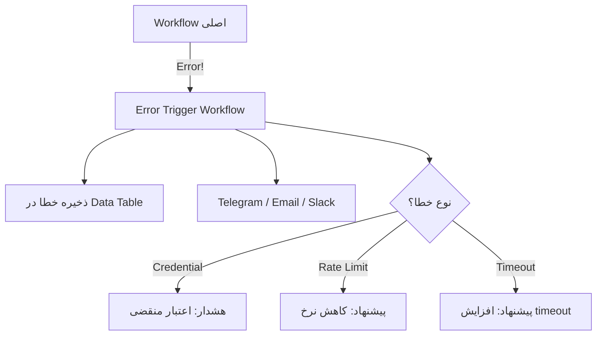
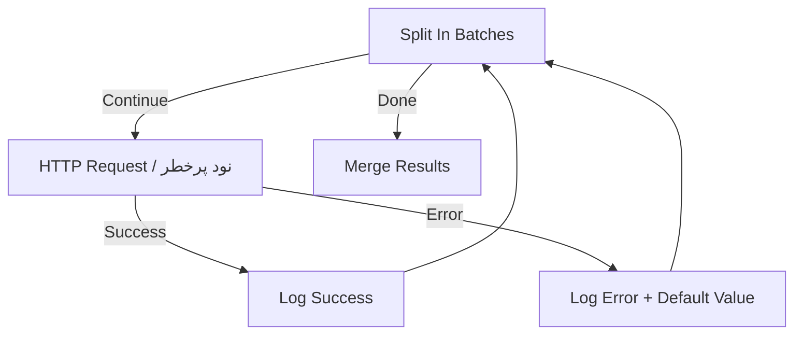
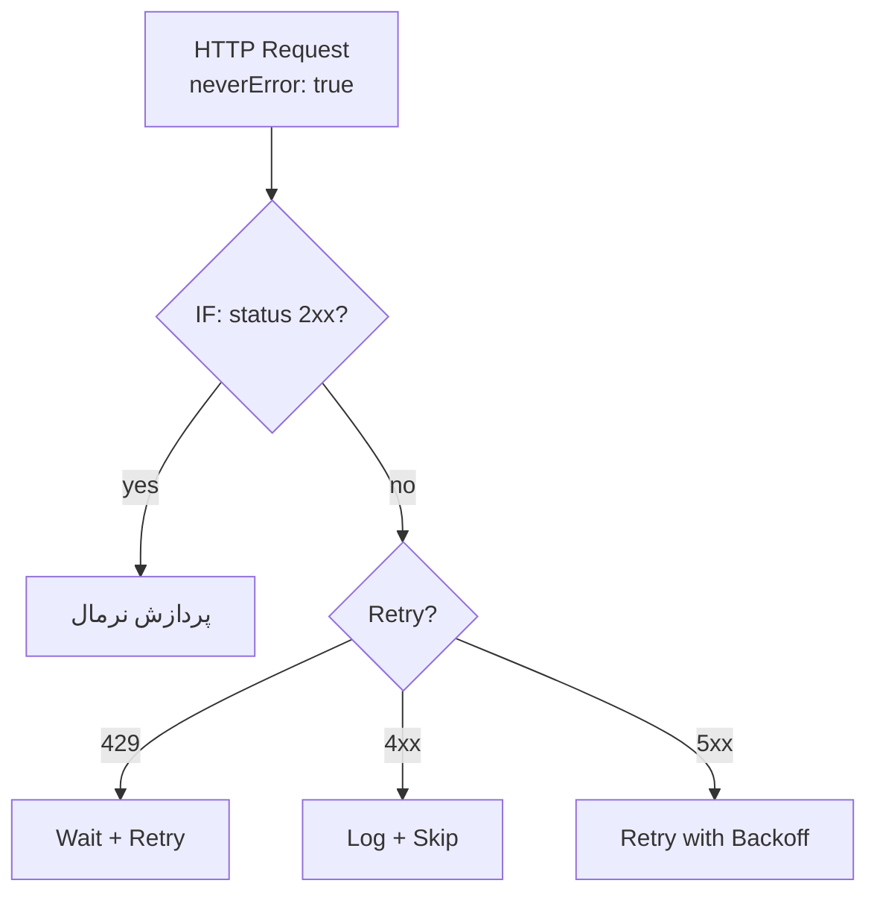
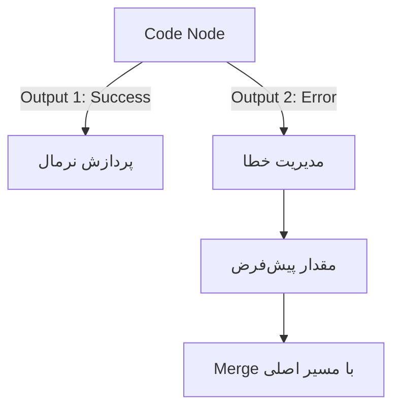
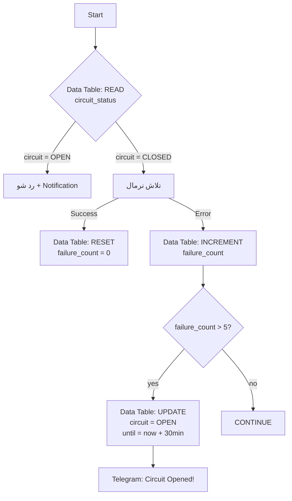
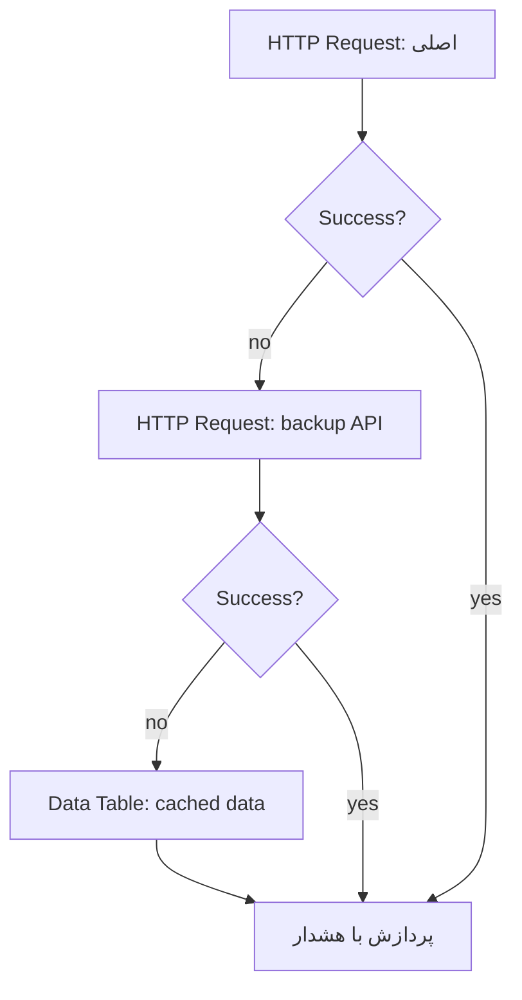
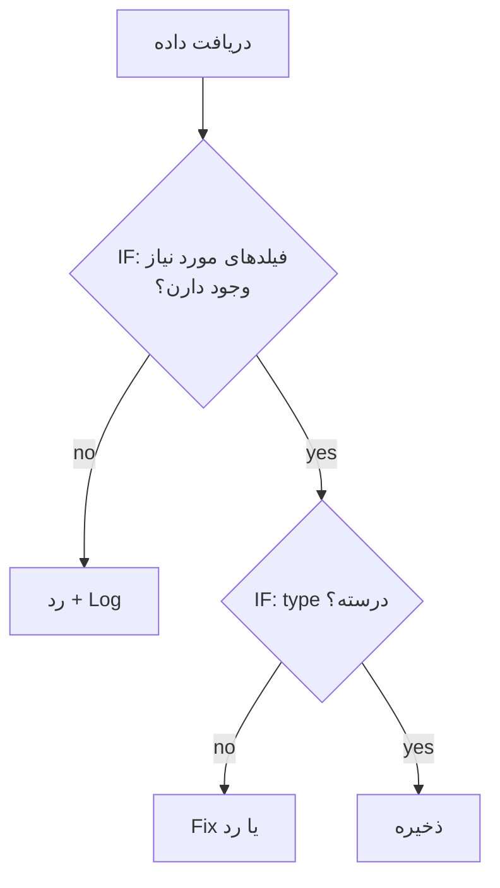
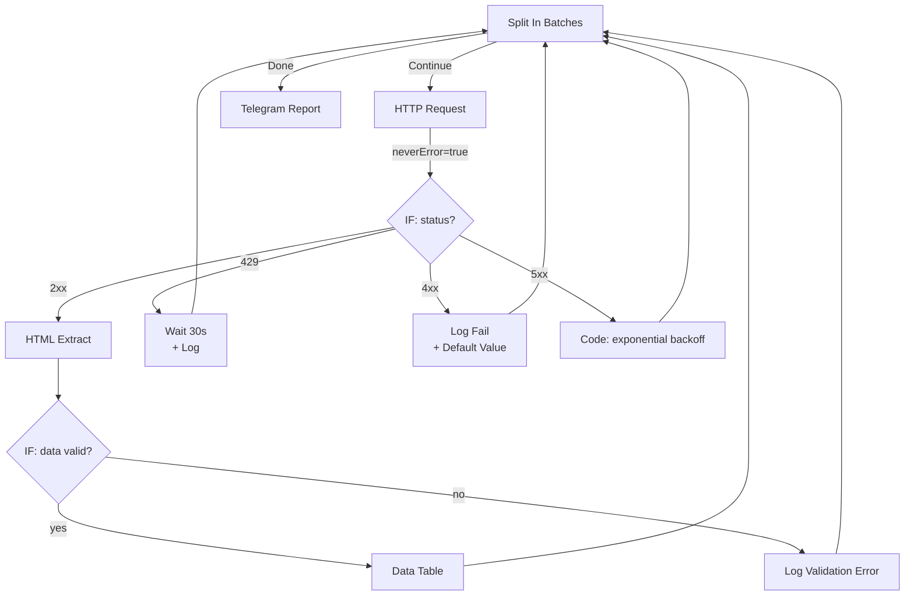
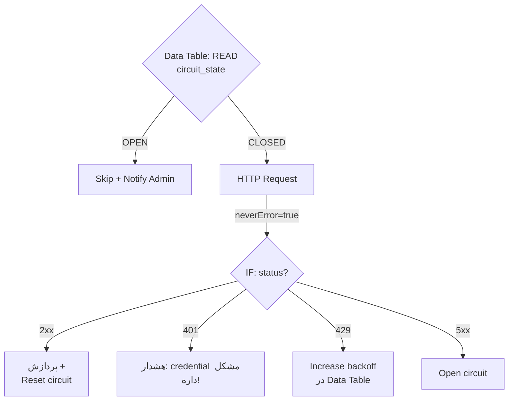

# Pattern: Error Handling — مدیریت خطا (Cross-cutting)

> Technique key: `error_handling`
> مدیریت خطاها در تمام workflowها — Retry, Fallback, Notification, Circuit Breaker

---

## ۱. معرفی

Error Handling یه **Cross-cutting Concern** هست — توی همه workflowها کاربرد داره: scraping, form, scheduling, API calls, data processing, AI Agent.

**سه سطح مدیریت خطا:**

| سطح | توضیح | کجا اعمال می‌شه |
|------|-------|----------------|
| **Level 1: Node Retry** | تلاش مجدد روی یه نود خاص | تنظیمات داخلی هر نود |
| **Level 2: Workflow Error Handler** | workflow جدا برای خطاهای کلی | Error Trigger + تنظیم Error Workflow |
| **Level 3: Inline Try-Catch** | مدیریت خطا در خود workflow | IF + Split In Batches + Data Table |

---

## ۲. Level 1: Node Retry — تلاش مجدد روی نود

ساده‌ترین سطح — بیشتر نودها (مخصوصاً HTTP Request) از Retry on Fail پشتیبانی می‌کنن.

### تنظیمات Retry:

| پارامتر | توضیح | محدوده |
|---------|-------|--------|
| `retryOnFail` | فعال/غیرفعال | true / false |
| `maxTries` | حداکثر تعداد تلاش | ۲ تا ۵ |
| `waitBetweenTries` | ms بین تلاش‌ها | ۰ تا ۵۰۰۰ |

### کی جواب میده:

| وضعیت | توضیح |
|-------|-------|
| ✅ **429 Rate Limit** | صبر کن و دوباره بزن |
| ✅ **502/503 Temporary** | خطای موقت سرور — معمولاً بعد چند ثانیه حل می‌شه |
| ✅ **504 Gateway Timeout** | timeout موقت |
| ✅ **Network Glitch** | قطعی لحظه‌ای شبکه |
| ❌ **400 Bad Request** | خطای کاربر — retry فایده نداره |
| ❌ **401/403 Unauthorized** | مشکل احراز هویت |
| ❌ **404 Not Found** | منبع وجود نداره |

### محدودیت:
- فقط برای **همون یه نود** اعمال می‌شه
- بین retryها **منطق شرطی** نمی‌تونی بذاری
- لاگ یا نوتیفیکیشن برای retryها نداره

---

## ۳. Level 2: Error Trigger + Error Workflow — workflow مجزای خطا

> نود: `n8n-nodes-base.errorTrigger` (v1)

برای مانیتورing متمرکز خطاهای همه workflowها.

### نحوه تنظیم:

۱. یه workflow مجزا بساز با **Error Trigger**
۲. توی **main workflow** → Settings → Error Workflow → اون رو انتخاب کن
۳. هر وقت main workflow fail بشه، error workflow اجرا می‌شه



### Error Trigger workflow نمونه:

```
[Error Trigger]
    ↓
[Set: آماده‌سازی داده]
  - workflow_name: {{ $json.workflow.name }}
  - error_message: {{ $json.error.message }}
  - node_name: {{ $json.error.node.name }}
  - timestamp: {{ $now.toISO() }}
    ↓
[Data Table: INSERT error_logs]
    ↓
[Telegram: ارسال هشدار]
  - متن: "⚠️ خطا در {{ workflow_name }}
          نود: {{ node_name }}
          خطا: {{ error_message }}"
```

### پارامترهای Error Trigger:

| متغیر | توضیح |
|-------|-------|
| `$json.workflow.id` | ID workflow |
| `$json.workflow.name` | اسم workflow |
| `$json.workflow.active` | آیا workflow فعال بود؟ |
| `$json.error.message` | متن خطا |
| `$json.error.description` | توضیحات خطا |
| `$json.error.node.name` | اسم نودی که خطا داد |
| `$json.error.node.type` | نوع نود |
| `$json.error.timestamp` | زمان خطا |
| `$json.error.nodeOutput` | آخرین خروجی نودهای قبل |

### ⚠️ محدودیت حیاتی:
> Error Workflow فقط برای **Production executions** اجرا می‌شه، نه Manual/Test runs. برای تست کردن باید workflow رو Publish کنی.

---

## ۴. Level 3: Inline Try-Catch — مدیریت خطا در خود workflow

برای زمانی که می‌خوای workflow **ادامه بده** حتی اگه یه نود خطا داد — مثل اسکرپینگ که بعضی URLها ممکنه fail بشن.

### ۴.۱ Try-Catch با Split In Batches



**مزیت:** workflow هیچوقت کامل fail نمی‌شه — فقط اون یه آیتم خطا می‌ده.

### ۴.۲ Try-Catch با IF + neverError

توی HTTP Request از `neverError: true` استفاده کن، بعد خودت status code رو چک کن:



**تنظیمات HTTP Request:**
```json
{
  "options": {
    "response": {
      "response": {
        "fullResponse": true,
        "neverError": true
      }
    }
  }
}
```

بعدش با IF status code رو چک کن:
```javascript
// شرط success:
{{ $json.statusCode >= 200 && $json.statusCode < 300 }}

// شرط rate limit:
{{ $json.statusCode === 429 }}

// شرط error واقعی:
{{ $json.statusCode >= 400 }}
```

### ۴.۳ Try-Catch با Error Output (n8n自带)

بعضی نودها مثل **If**, **Switch**, **Code** دو خروجی دارن — می‌تونی از خروجی دوم برای error handling استفاده کنی:



> فقط Code و Function Item دو خروجی دارن — HTTP Request یک خروجی داره.

---

## ۵. Retry Pattern — الگوهای تلاش مجدد

### ۵.۱ Simple Retry (با Wait Node)

```
[نود] → [IF: خطا؟] → [Wait 5s] → [نود] → [IF: خطا؟] → ... (حداکثر N بار)
```

### ۵.۲ Exponential Backoff

با Code Node می‌تونی backoff پیاده‌سازی کنی:

```javascript
// JS — برای نود Code (runOnceForEachItem)
const attempt = $json._retryAttempt || 0;
const maxRetries = 3;
const baseDelay = 1000; // 1 second

if (attempt >= maxRetries) {
  // از حداکثر تلاش گذشته — رد شو
  return { ...$json, status: 'failed', error: $json._lastError };
}

const delay = baseDelay * Math.pow(2, attempt);
// مقدار رو ذخیره کن برای نود بعدی
return {
  ...$json,
  _retryAttempt: attempt + 1,
  _retryDelay: delay
};
```

بعد از Code، یه **Wait** node با مقدار `={{ $json._retryDelay }}` بذار، و یه **IF** که چک کنه `status !== 'failed'`.

### ۵.۳ Conditional Retry

همه خطاها ارزش retry ندارن — فقط types خاصی:

```
[خطا] → [Switch: status code]
  ├── 429 → [Wait 30s + Retry]
  ├── 502/503 → [Wait 10s + Retry]
  ├── 504 → [Wait 60s + Retry]
  ├── 4xx (غیر 429) → [Log + Skip] ❌ فایده نداره
  └── 5xx باقی‌مونده → [Wait + Retry + سپس Skip]
```

---

## ۶. Circuit Breaker Pattern — قطع کن تا درست شه

برای APIهایی که مکرراً خطا میدن — به جای retry بی‌هدف، یه وقفه بنداز.

### با Data Table:



**ساختار Data Table پیشنهادی (circuit_state):**

| فیلد | type | توضیح |
|------|------|-------|
| `workflow_id` | string | شناسه workflow |
| `circuit` | string | OPEN / CLOSED / HALF_OPEN |
| `failure_count` | number | تعداد خطاهای متوالی |
| `last_failure_at` | date | آخرین زمان خطا |
| `opened_at` | date | زمان باز شدن circuit |
| `cooldown_until` | date | تا کی circuit بسته بمونه |

---

## ۷. Fallback Pattern — جایگزین هوشمند

وقتی یه سرویس در دسترس نیست، از یه جایگزین استفاده کن:



**مثال اسکرپینگ:**
```
1. Perplexity Search (اولویت اول)
2. ↓ اگر fail شد
3. HTTP Request + HTML Extract (اولویت دوم)
4. ↓ اگر fail شد
5. Data Table: داده کش شده دیروز (اولویت سوم با هشدار)
```

---

## ۸. Data Validation — اعتبارسنجی داده

قبل از پردازش یا ذخیره، داده رو validate کن:



### نمونه validation با IF:

```javascript
// شرط‌های IF
{{ $json.title != null && $json.title.length > 0 }}
{{ $json.price != null && !isNaN(Number($json.price)) }}
{{ $json.email != null && $json.email.includes('@') }}
```

---

## ۹. Logging & Monitoring — ثبت و هشدار

### Data Table ساختار logs:

| فیلد | type | توضیح |
|------|------|-------|
| `id` | auto | — |
| `workflow_name` | string | اسم workflow |
| `node_name` | string | نودی که خطا داد |
| `error_type` | string | timeout / rate_limit / auth / validation / unknown |
| `error_message` | text | متن خطا |
| `input_data` | text | خلاصه داده ورودی (اختیاری) |
| `timestamp` | date | زمان خطا |
| `retried` | boolean | آیا retry انجام شد؟ |
| `resolved` | boolean | آیا رفع شد؟ |

### Cron Job برای پاکسازی:

```
Schedule Trigger (هفته‌ای یک بار)
  → Data Table: DELETE WHERE timestamp < NOW() - 30 days
```

### گزارش هفتگی خطاها:

```
Schedule Trigger (یکشنبه‌ها ۹ صبح)
  → Data Table: SELECT error_type, COUNT(*) FROM error_logs
  → AI Agent: تحلیل و خلاصه
  → Telegram: ارسال به ادمین
```

---

## ۱۰. الگوهای ترکیبی

### Pattern A: High-Performance Scraper



### Pattern B: Sensitive API Call



### Pattern C: User-Facing Form

```mermaid
flowchart TD
    FORM[Form Trigger] --> TRY[ذخیره در Data Table]
    TRY -->|Success| OK[پاسخ موفق به کاربر]
    TRY -->|Error| RETRY[تلاش مجدد<br/>حداکثر ۳ بار]
    RETRY -->|یکی成功| OK
    RETRY -->|همه fail| CACHE[ذخیره در Local File<br/>+ هشدار به ادمین]
    CACHE --> RESPOND[پاسخ به کاربر:<br/>"ثبت شد، بعداً پردازش میشه"]
```

---

## ۱۱. خطاهای رایج در Error Handling

### 🕳️ Error Workflow تست نمی‌شه
Error Workflow فقط برای **production** اجرا می‌شه — manual execution خطا می‌ده یا اجرا نمی‌شه. حتماً publish کن و با production mode تست کن.

### 🕳️ Retry بی‌نهایت
همیشه `maxTries` رو محدود کن. وگرنه workflow تا ابد تلاش می‌کنه.

### 🕳️ Overlooking neverError
پیش‌فرض HTTP Request روی هر status non-2xx خطا می‌گیره — اگه می‌خوای خودت هندل کنی، `neverError: true` رو فعال کن.

### 🕳️ Circuit Never Resets
فراموش نکن یه کرون جاب برای ریست کردن circuitها بذاری که بعد از N ساعت خودشونو ببندن و دوباره امتحان کنن.

### 🕳️ Log Overload
همه خطاها رو توی Data Table نریز — فقط خطاهای واقعی رو log کن. خطاهای موقت (مثل 429 که retry شده) نیاز به log ندارن.

---

## ۱۲. خلاصه انتخاب стратеژی

| سناریو | بهترین Strategy |
|--------|----------------|
| **API call ساده** | Node Retry (Level 1) |
| **Scraping چند URL** | Inline Try-Catch با Split In Batches (Level 3) |
| **API حیاتی** | Circuit Breaker + Fallback |
| **کل workflow** | Error Workflow (Level 2) |
| **فرم کاربر** | Inline Try-Catch + Fallback به Local File |
| **Cron Job** | Error Workflow + Notification |
| **AI Agent** | مدل خودش handling داره — ولی Error Trigger بذار |
| **چند API موازی** | Split In Batches + Try-Catch برای هر کدوم |

---

## ۱۳. نودهای معرفی شده

| نود | کاربرد |
|-----|--------|
| `errorTrigger` | شروع Error Workflow |
| `httpRequest` | با `neverError` برای inline handling |
| `if` / `switch` | مسیریابی بر اساس نوع خطا |
| `wait` | تأخیر بین retryها |
| `splitInBatches` | Try-Catch روی چند آیتم |
| `code` | exponential backoff, validation |
| `dataTable` | circuit state, error logs |
| `set` | آماده‌سازی داده خطا |
| `telegram` / `email` / `slack` | Notification |
