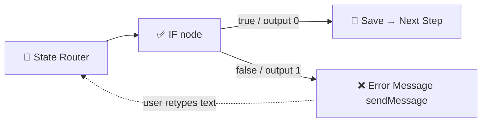

# Input Validation in Telegram Checkout Flows

> الگوی اعتبارسنجی ورودی کاربر در فرآیند چک‌اوت — با **If node + boolean expression**

## 🚨 دو رویکرد غلط که کار نمی‌کنن

1. **Switch (expression mode)** برای validation — `={{ $json.message.text.match(...) ? 0 : 1 }}` → Switch برای Route کردن طراحی شده، fallback output نامشخص می‌ده (Trap 55)
2. **If node با regexMatch operator** — `{ operation: "regexMatch", type: "string" }` → n8n شرط رو نادیده می‌گیره، همیشه false برمی‌گردونه (Trap 54)

## ✅ الگوی درست: If node + boolean expression



### جزئیات نودها

**✅ IF (validation)** — `n8n-nodes-base.if` (version 2.3):
```json
{
  "conditions": {
    "combinator": "and",
    "conditions": [{
      "leftValue": "={{ ($json.message.text || '').match(/^09\\\\d{9}$/) !== null }}",
      "operator": { "type": "boolean", "operation": "equals" },
      "rightValue": true
    }],
    "options": { "version": 3, "caseSensitive": true, "leftValue": "", "typeValidation": "strict" }
  },
  "options": { "ignoreCase": false, "looseTypeValidation": false }
}
```

> **مهم:** leftValue خودش یک عبارت boolean هست (توسط `.match(...) !== null`). If فقط چک می‌کنه که `true === true` باشه. هیچ regex تو سطح If node نیست.

### چرا If + boolean کار می‌کنه ولی روش‌های دیگه نه؟

| روش | Why it fails/succeeds |
|-----|----------------------|
| Switch expression | Switch خروجی رو با fallback مقایسه می‌کنه، validation نیست |
| If + regexMatch | n8n `regexMatch` operator buggy — همیشه false |
| **If + boolean expression** ✅ | leftValue مستقیم true/false هست، If فقط `=== true` چک می‌کنه |

### اکسپرشن‌های اعتبارسنجی (همه با boolean equals true)

| فیلد | leftValue (expression) |
|------|----------------------|
| **نام** | `{{ ($json.message.text \|\| '').trim().length > 0 }}` |
| **شماره تماس ایران** | `{{ ($json.message.text \|\| '').match(/^09\d{9}$/) !== null }}` |
| **آدرس** | `{{ ($json.message.text \|\| '').trim().length > 0 }}` |
| **کد پستی ایران** | `{{ ($json.message.text \|\| '').match(/^\d{10}$/) !== null }}` |

### خوشه‌بندی نودها

```
🔀 State Router
  ├── [0] checkout_name  → ✅ IF Name
  │                          ├─ [true]  → 💾 Save Name → Phone  → 📞 Ask Phone
  │                          └─ [false] → ❌ Invalid Name (sendMessage)
  │
  ├── [1] checkout_phone → ✅ IF Phone
  │                          ├─ [true]  → 💾 Save Phone → Address → 🏠 Ask Address
  │                          └─ [false] → ❌ Invalid Phone (sendMessage)
  │
  ├── [2] checkout_address → ✅ IF Address
  │                          ├─ [true]  → 💾 Save Address → Postal → 📮 Ask Postal Code
  │                          └─ [false] → ❌ Invalid Address (sendMessage)
  │
  └── [3] checkout_postal → ✅ IF Postal
                             ├─ [true]  → 💾 Save Postal → Summary → 📄 Order Summary
                             └─ [false] → ❌ Invalid Postal (sendMessage)
```

## نکات مهم Telegram node

- **`resource` باید `"chat"` باشه** برای sendMessage و editMessageText. `"message"` validation error می‌ده (فقط `chat`, `callback`, `file` معتبره)
- اگر با `updateNodeParameters + replace: true` پارامترها رو عوض کردی، **حتماً `resource` و `operation` رو هم توی replace payload بذار** — `replace: true` همه رو پاک می‌کنه و دوباره می‌نویسه
- **Credential همه نودهای Telegram** باید یکسان باشه (معمولاً `bale_bot_evet_rosteri`). auto-assign اشتباه می‌کنه

## نکات

- **کاربر توی همون state می‌مونه** — چون Save نکردیم، بعد از پیام خطا State Router دوباره همون state رو می‌خونه
- `chat_id` برای پیام خطا از `$json.chat_id` (که از Merge Session + Msg میاد) بگیر
- Always save `last_sent_at` + `updated_at` together with state in every save DataTable node
- `removeConnection` + `removeNode` + `addNode` + `addConnection` باید ترتیب درست داشته باشه — اول همه رو قطع کن، بعد حذف، بعد اضافه، بعد وصل