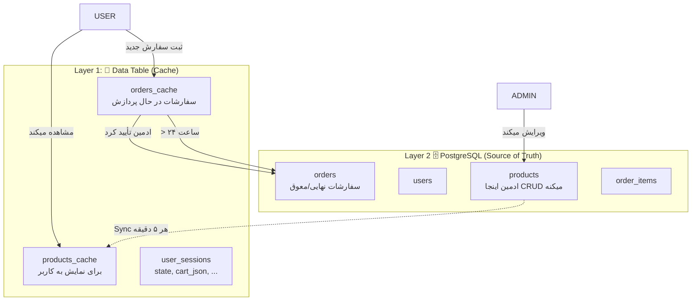
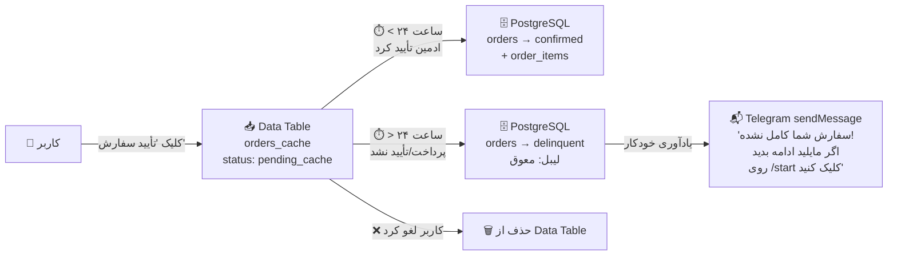

# Telegram Bot Patterns — n8n (v2.0)

> الگوهای ویژه برای طراحی ربات‌های تلگرام در n8n.
> برگرفته از بازخورد کاربر در Session 2026-07-09 (اصلاح مسیریابی و پترن‌های روتینگ).

---

## 1. Sub-workflow Communication: Execute Workflow

### ❌ اشتباه رایج

استفاده از **HTTP Request + Webhook** برای صدا زدن ورک‌فلوهای دیگر:

```
WF01 → [HTTP Request] → (POST webhook) → WF02
```

مشکلات:
- نیاز به مدیریت webhook URLها
- تأخیر شبکه
- خطاهای HTTP
- وابستگی به اینترنت n8n

### ✅ روش درست

استفاده از **`Execute Sub-workflow`** (`n8n-nodes-base.executeWorkflow`):

```
WF01 → [Execute Sub-workflow] → WF02 [Execute Workflow Trigger]
```

**در WF01 (والد):**
```
Node: n8n-nodes-base.executeWorkflow
  source: "database"
  workflowId: (انتخاب از لیست)
  workflowInputs: (تعریف فیلدهای ورودی)
    - chat_id (string)
    - user_id (string)
    - message_id (string)
    - text (string) — متن پیام کاربر
    - callback_data (string) — دیتای دکمه (در صورت وجود)
    - admin_action (string) — عملیات ادمین
  mode: "once" — همه آیتم‌ها یکجا
  options.waitForSubWorkflow: true
```

**در WF02 (فرزند — دریافت‌کننده):**
```
Node: n8n-nodes-base.executeWorkflowTrigger
  inputSource: "workflowInputs"
  workflowInputs.values:
    - name: "chat_id", type: "string"
    - name: "text", type: "string"
    - name: "message_id", type: "string"
```

**خروجی WF02 به WF01:**
خروجی آخرین نود WF02 به WF01 برمی‌گرده. از `set` برای ساخت خروجی استفاده کن:

```json
{
  "response": "متن پاسخ...",
  "message_id": 123,
  "chat_id": "123456",
  "escalated": false
}
```

### قانون

> هر وقت نیاز به صدا زدن یه ورک‌فلو دیگه داری → **Execute Sub-workflow** بزن، نه HTTP Request.
> این کار باعث می‌شه ورک‌فلوها وابستگی به webhook URL نداشته باشن و خطاهای کمتری داشته باشن.

---

## 2. Message Editing Pattern (ادیت پیام)

### ❌ اشتباه رایج
```
کاربر: /start → ربات: sendMessage (msg 1)
کاربر: محصولات → ربات: sendMessage (msg 2)
کاربر: قهوه A → ربات: sendMessage (msg 3)
→ چت شلوغ، کاربر گیج می‌شه
```

### ✅ روش درست — دو قانون جدا

> **قانون ۱ (دکمه و فرمان):** کاربر دکمه می‌زنه یا دستور متنی می‌ده → `editMessageText` (همون پیام فعلی ادیت بشه)

```
کاربر: /start     → ربات: sendMessage        [msg_id=100]  ← اولین و آخرین پیام جدید
کاربر: محصولات    → ربات: editMessageText     (msg_id=100)
کاربر: قهوه A     → ربات: editMessageText     (msg_id=100)
کاربر: ۵۰۰ گرم    → ربات: editMessageText     (msg_id=100)
کاربر: سبد خرید   → ربات: editMessageText     (msg_id=100)
→ فقط یک پیام تو چت!
```

> **قانون ۲ (ورود متن توسط کاربر):** کاربر متن آدرس، کد رهگیری یا سوال پشتیبانی رو تایپ می‌کنه → `sendMessage` (پیام جدید)

```
کاربر: نهایی‌سازی  → ربات: editMessageText    (msg_id=100)  ← دکمه بود
کاربر: تهران،...   → ربات: sendMessage         ← کاربر متن تایپ کرد!  [msg_id=200]
🐇 بعد از sendMessage → ذخیره msg_id=200 برای ادیت‌های بعدی
کاربر: ثبت نهایی    → ربات: editMessageText    (msg_id=200)  ← دکمه بود
```

**چرا؟** کاربر متن تایپ کرده و پیامش توی چت ظاهر شده. اگه ربات پیام قبلی رو ادیت کنه، کاربر پیام خودش رو نمی‌بینه و مکالمه ناقص به نظر می‌رسه. `sendMessage` باعث میشه مکالمه طبیعی باشه:

```
🤖 ربات: لطفاً آدرس خود را وارد کنید:      ← edit از msg قبلی
👤 کاربر: تهران، خیابان ولیعصر، پلاک ۱۲۳  ← پیام کاربر (جدا)
🤖 ربات: ✅ آدرس ثبت شد! خلاصه سفارش...   ← **sendMessage جدید!**
```

### پیاده‌سازی

**نود Telegram:**
```
resource: "message"
operation: "sendMessage"       → برای /start و پاسخ به متن کاربر
operation: "editMessageText"   → برای کلیک دکمه و دستورات متنی (menu/cart/orders)
```

**پارامترهای editMessageText:**
```typescript
{
  messageType: "message",
  chatId: "={{ $json.chat_id }}",
  messageId: "={{ $json.last_message_id }}",  // از session
  text: "متن جدید...",
  replyMarkup: "inlineKeyboard",
  inlineKeyboard: { rows: [...] }
}
```

### مدیریت message_id — اصلاحیه v2.0

> **🔴 نیازی به ذخیره message_id در سشن نیست!** هر پیام تلگرام خودش message_id داره.
> اشتباه رایج: ذخیره `last_message_id` در Data Table و خوندنش برای editMessageText.

**دسترسی به message_id مستقیم از Trigger:**
```
// برای callbck دکمه:
{{ $json.callback_query.message.message_id }}

// برای پیام متنی:
{{ $json.message.message_id }}
```

**پس:** برای editMessageText کافیه از همون message_id که توی Trigger اومده استفاده کنی.

> **قانون:** `message_id` رو توی سشن ذخیره نکن. از `$json.callback_query.message.message_id` مستقیم توی Telegram node استفاده کن.

### جدول تصمیم‌گیری

| نوع ورودی کاربر | مثال | رفتار ربات | دلیل |
|----------------|------|-----------|------|
| 🔘 کلیک دکمه | view_products, checkout, confirm_order | `editMessageText` | سویچ بین منوها — یه پیام تمیز |
| ⌨️ دستور متنی | /start, /menu, /cart, /orders | `editMessageText` | معادل دکمه — یه پیام تمیز |
| ✏️ متن آزاد کاربر | آدرس، کد رهگیری، سوال پشتیبانی | `sendMessage` | پیام کاربر اومده، ربات باید جدا جواب بده |
| 🔔 اعلان سیستمی | تأیید ادمین، یادآوری ۲۴h | `sendMessage` | مستقل از مکالمه فعلی |

### هشدار

> **`editMessageText` رو برای پاسخ به متن کاربر استفاده نکن.** کاربر متنش رو توی چت می‌بینه و ربات پیام قبلی رو ادیت می‌کنه — گیج‌کننده‌ست. همیشه `sendMessage` برای پاسخ به ورود متنی کاربر. ذخیره `message_id` جدید رو فراموش نکن!

---

## 3. No-Code Core Hub

### ❌ اشتباه رایج

استفاده از **Code Node** برای استخراج و نرمال‌سازی دیتای Telegram:

```
[Telegram Trigger] → [Code (Extract Data)] → [Switch]
```

### ✅ روش درست

Telegram Trigger خودش داده‌های ساختاریافته تحویل می‌ده. با **Switch** مستقیم مسیریابی کن:

```
[Telegram Trigger] → [Switch]
```

**تشخیص نوع پیام با Switch:**
```typescript
// برای تشخیص message یا callback_query:
// شاخه ۱: اگه {{ $json.message }} وجود داشت → پیام متنی
// شاخه ۲: اگه {{ $json.callback_query }} وجود داشت → کلیک دکمه

// برای تشخیص دستورات متنی:
// شاخه ۱: {{ $json.message.text }} == "/start"
// شاخه ۲: {{ $json.message.text }} == "/menu"
// شاخه ۳: else → متن آزاد (مثلاً برای AI Agent)
```

**دسترسی به دیتا از Trigger:**
```
پیام متنی:  {{ $json.message.text }}
فرستنده:    {{ $json.message.from.id }}  یا  {{ $json.message.chat.id }}
اسم کاربر:  {{ $json.message.from.first_name }}
کالبک دیتا: {{ $json.callback_query.data }}
آی‌دی کالبک: {{ $json.callback_query.id }}
message_id: {{ $json.message.message_id }}  یا
            {{ $json.callback_query.message.message_id }}
```

### قانون

> **Code Node ممنوع در Core Hub.** Telegram Trigger داده رو مستقیم و ساختاریافته می‌ده. با `switch` و `set` و `if` می‌تونی همه چیز رو مسیریابی و تبدیل کنی. Code Node فقط برای پردازش‌های خاص (aggregate چند آیتم، منطق پیچیده) استفاده بشه.

---

## 4. AI Agent Memory Pattern

### ❌ اشتباه رایج

خوندن دستی memory و پاس دادن context به Agent:

```
[Postgres Memory Read] → [Code (format)] → [AI Agent: context]
```

### ✅ روش درست

Agent خودش memory رو مدیریت می‌کنه. فقط کافیه:

- `Postgres Chat Memory` رو به `AI Agent` وصل کنی (**کانکشن `ai_memory`**)
- `sessionKey` رو برابر `chat_id` بذاری
- `contextWindowLength` رو تعیین کنی

```
[AI Agent] ← [OpenRouter Chat Model] (ai_languageModel)
[AI Agent] ← [Postgres Chat Memory] (ai_memory)  ← فقط وصل کن!
```

**تنظیمات Postgres Chat Memory:**
```typescript
{
  sessionKey: "={{ $json.chat_id }}",
  sessionIdType: "customKey",
  contextWindowLength: 20  // ۲۰ پیام آخر
}
```

Agent به صورت خودکار:
- تاریخچه رو از memory می‌خونه
- context رو به LLM می‌ده
- پاسخ جدید رو توی memory ذخیره می‌کنه

### قانون

> **به Agent اعتماد کن.** نودهای Memory (Postgres Chat Memory, Buffer Window Memory, ...) رو فقط کافیه به Agent وصل کنی با `ai_memory` connection. Agent خودش می‌دونه چجوری بخونه، context بده و ذخیره کنه. داری کار Agent رو براش انجام میدی؟ → اشتباهه، بذار خودش انجام بده.

---

## 5. Callback Data Conventions

### نام‌گذاری دکمه‌ها (callback_data)

```
فرمت کلی: [scope]_[action]_[optional_id]

منطقه‌های اصلی:
  view_*       → مشاهده
  add_*        → افزودن
  remove_*     → حذف
  edit_*       → ویرایش
  select_*     → انتخاب
  admin_*      → ادمین
  order_*      → سفارش
  back_*       → برگشت
```

**جدول کامل:**

| callback_data | معنی |
|--------------|-------|
| callback_data | معنی | چه stageای مجازه |
|--------------|-------|----------------|
| `view_products` | مشاهده محصولات | idle |
| `view_product_{id}` | جزئیات محصول با id مشخص | idle → state=selecting_weight |
| **`weight_{id}_{grams}`** | انتخاب وزن مثلاً `weight_1_500` | فقط state=selecting_weight |
| `view_cart` | مشاهده سبد خرید | idle |
| `checkout` | شروع فرآیند خرید | idle → state=checkout_address |
| `confirm_order` | تأیید نهایی سفارش | idle (بعد از خلاصه سفارش) |
| **`cancel_checkout`** | لغو فرآیند خرید | فقط state=checkout_address |
| **`cancel_search`** | لغو جستجوی سفارش | فقط state=searching_order |
| `clear_cart` | خالی کردن سبد | idle |
| **`continue_shopping`** | ادامه خرید — برگشت به محصولات | idle |
| `back_to_menu` | برگشت به منوی اصلی | idle (یا هر state ← reset) |
| `view_orders` | مشاهده سفارشات | idle |
| `search_order` | جستجوی کد پیگیری | idle → state=searching_order |
| `admin_dashboard` | داشبورد ادمین | idle → WF03 |
| `admin_products` | مدیریت محصولات | idle → WF03 |
| `admin_orders` | مدیریت سفارشات | idle → WF03 |
| `admin_customers` | مدیریت مشتریان | idle → WF03 |
| `admin_broadcast` | ارسال پیام جمعی | idle → WF03 |
| `admin_reports` | گزارش‌ها | idle → WF03 |
| `order_{id}_status_{new_status}` | تغییر وضعیت سفارش | WF03 — admin action |

> **نکته مهم:** بعضی callback_dataها فقط در state خاصی مجاز هستن. `weight_1_500` رو فقط در state=selecting_weight می‌تونیم پردازش کنیم. `cancel_checkout` رو فقط در state=checkout_address. این edge cases در state handlerها بررسی می‌شن.

### قانون

> **callback_data رو با دقت نام‌گذاری کن.** از `/` و کاراکترهای خاص استفاده نکن (Telegram محدودیت داره). از `_` جداکننده و prefix برای مسیریابی استفاده کن. ترتیب: `scope_action_detail`.

---

## 6. Order Validation Pattern

قبل از ثبت سفارش، این ۵ مرحله رو حتماً بررسی کن:

```
[1] محصول وجود دارد؟     ← postgres WHERE id=X AND is_active=true
    ↓ بله
[2] موجودی کافی؟         ← postgres WHERE stock >= quantity
    ↓ بله
[3] آدرس معتبر؟          ← if: متن >= 10 کاراکتر
    ↓ بله
[4] کاربر مسدود نیست؟    ← postgres WHERE is_blocked=false
    ↓ بله
[5] سبد خرید خالی نیست؟  ← if: cart_json.length > 0
    ↓ همه تأیید ✅
[ثبت سفارش]
```

**بعد از ثبت:**
1. گرفتن کد پیگیری (از sequence جدول)
2. `INSERT INTO orders`
3. `INSERT INTO order_items`
4. `UPDATE products SET stock = stock - quantity`
5. پاک کردن سبد از session
6. ارسال پیام تأیید به کاربر (editMessageText)
7. اعلان به ادمین (sendMessage)

### ⚠️ Dual Stock Validation (اعتبارسنجی دوبله موجودی)

> **موجودی رو دوبار چک کن:** یکبار وقتی محصول به سبد اضافه می‌شه (add to cart) و بار دوم در لحظه ثبت سفارش (confirm order).
> چون بین این دو مرحله، یه کاربر دیگه ممکنه آخرین موجودی رو خریده باشه!

```
Add to Cart:
  → Check stock: موجودی >= 1 ✅ → اضافه به سبد (موقت)
  → اگه نبود: "موجودی کافی نیست"

Confirm Order:
  → Re-validate stock برای همه آیتم‌های سبد (SELECT از PostgreSQL)
  → اگه تغییری کرده بود: "متأسفانه موجودی {product} برای وزن {weight} کافی نیست. لطفاً سبد را ویرایش کنید."
  → اگه اوکی بود: INSERT + UPDATE stock
```

**چرا دوبار؟**
- بار اول: جلوگیری از add کردن محصول ناموجود
- بار دوم: جلوگیری از ثبت سفارش با موجودی قدیمی (race condition بین کاربران)

### قانون

> **هیچ سفارشی بدون اعتبارسنجی ثبت نشه.** ۵ مرحله بالا رو به ترتیب اجرا کن. اگه یکی failed → به کاربر بگو دقیقاً什么问题 و برگردون به مرحله مناسب.

---

## 7. Core Routing Pattern — 4 مسیر اصلی

> **🔴 بزرگ‌ترین اشتباه:** Session State Machine (نسخه v1) الگوی State-First رو مطرح کرد که اشتباه است.
> **الگوی درست:** Type-First (4 مسیر اصلی) + Session State Management در بخش‌های بعدی

### 🎯 چهار مسیر اصلی روتر

## 7. Core Routing Pattern — 5 مسیر اصلی (Switch-based)

> **🔴 بزرگ‌ترین اشتباه:** Session State Machine (نسخه v1) الگوی State-First رو مطرح کرد که اشتباه است.
> **الگوی درست:** Type-First با Switch — بدون Code Node در Core Router

### 🎯 پنج مسیر اصلی روتر

Telegram Trigger → **Switch** (نه Code). Switch اولین rule که true باشه رو می‌گیره:

```
📱 Telegram Trigger
      │
      ▼
┌─── Switch: Route Rules ────┐
│  (expression mode, no code) │
│                              │
│  callback → callback_query   │
│  file     → photo/doc/voice │
│  command  → text.startsWith │
│              ('/')           │
│  text     → text (no /)      │
│  unknown  → fallback         │
└──────────┬──┬──┬──┬────┬────┘
    ┌──────┘  │  │  │    └──────┐
    ▼         ▼  ▼  ▼           ▼
 callback   file cmd  text     unknown
    │        │    │    │          │
    ▼        ▼    ▼    ▼          ▼
 editMsg   Code: /start  Session  NoOp
 + process ex-  /help   Check
            tract  ...  ┌──┴──┐
            fileId     new   existing
                        │      │
                        ▼      ▼
                     Welcome  AI/Logic
                     + set     + process
                     session
```

**Switch rules (expression mode):**

| مسیر | ترتیب | Expression |
|------|-------|-----------|
| `callback` | ۱ | `{{ $json.callback_query !== undefined }}` |
| `file` | ۲ | `{{ $json.message.photo \|\| $json.message.document \|\| $json.message.voice \|\| $json.message.audio \|\| $json.message.video \|\| $json.message.animation !== undefined }}` |
| `command` | ۳ | `{{ $json.message.text && $json.message.text.startsWith('/') }}` |
| `text` | ۴ | `{{ $json.message.text && !$json.message.text.startsWith('/') }}` |
| `unknown` | ۵ | fallback (default output) |

> **ترتیب outputs مهمه:** اول callback (خاص‌ترین)، بعد file، بعد command، بعد text، آخر unknown.

### استثنا: مسیر file نیاز به Code داره

Switch فقط route می‌کنه، transform نمی‌کنه. برای استخراج `fileId` و `fileType` از message:

```
[Switch: route → file]
    ↓
[Code: extract fileId + fileType]
    const msg = $input.first().json.message;
    let fileType = 'photo';
    if (msg.document) fileType = 'document';
    else if (msg.voice) fileType = 'voice';
    else if (msg.audio) fileType = 'audio';
    else if (msg.video) fileType = 'video';
    return [{
      json: {
        fileType,
        fileId: (msg.photo?.[msg.photo.length-1]?.file_id)
                || msg.document?.file_id || msg.voice?.file_id
                || msg.audio?.file_id || msg.video?.file_id,
        caption: msg.caption || '',
        mimeType: msg.document?.mime_type,
      }
    }];
```

این **تنها Code مجاز در Core Hub** هست. بقیه مسیرها مستقیم به Switch وصل می‌شن.

### State Machine — بخش دوم روتر (فقط برای مسیر text)

Session State توی Data Table ذخیره می‌شه و فقط برای مسیر `text` چک می‌شه:

| state | توضیح | مسیر مجاز |
|-------|-------|-----------|
| `idle` 🟢 | حالت آزاد — کاربر منو رو می‌بینه | ۱+۲+۳ (callback, file, command) + ۴ (متن آزاد → fallback) |
| `checkout_address` 📍 | کاربر باید آدرس بده | فقط ۴ (free text) |
| `searching_order` 🔍 | کاربر کد پیگیری می‌ده | فقط ۴ (free text) |

> **Commands (`/start`, `/menu`) و Callback همیشه کار می‌کنن** — state رو نادیده می‌گیرن. فقط `text` بر اساس state محدود می‌شه.

### مقایسه: الگوی قدیم vs جدید

| مرحله | ❌ State-First (نسخه ۱) | ✅ Type-First با Switch (نسخه ۳) |
|-------|------------------------|--------------------------------|
| ۱ | Get Session → Route by State | **Switch: تشخیص نوع update** (بدون کد) |
| ۲ | بعد state → نوع ورودی | بعد → Session State فقط برای text |
| ۳ | برای idle → Route by Callback/Message | callback, file, command بدون محدودیت |
| مشکل | کاربری که state=checkout داره، /start نمی‌بینه! | /start و دکمه‌ها همیشه کار می‌کنن |

**message_id نیاز به ذخیره نداره:**
```
{{ $json.message.message_id }}                    ← متن
{{ $json.callback_query.message.message_id }}     ← دکمه
```

---

## 8. Answer Callback Query — نیازی نیست!

> **اصلاحیه v2.0:** برخلاف نسخه v1، **نود Answer Callback Query در n8n نیازی نیست.**
> تلگرام خودش loading state رو بعد از editMessageText برطرف می‌کنه.
> پردازش callback با editMessageText کافیه — نیازی به نود جدا نیست.

### ✅ جریان درست

```
[Telegram Trigger] → [Switch (Route by Type)]
                        │
                        └── Callback branch → [Session Manager] → [Edit Message Text]
```

### دلیل

- n8n خودش handle کردن callback رو انجام میده
- editMessageText بعد از کلیک دکمه، loading رو برطرف می‌کنه
- افزودن Answer Callback Query نود اضافی بی‌فایده‌ست

### قانون

> **این نود رو به کور روتینگ اضافه نکن.** فقط editMessageText برای نمایش محتوای جدید بعد از کلیک دکمه کافیه.

---

## 9. Sub-workflow Output Pattern: AI Agent / Support WF

> **🔴 ورک‌فلوهای AI Agent (WF02) نباید خودشون پیام به کاربر بفرستن.**
> ارسال پیام وظیفه ورک‌فلو اصلی (WF01) هست.

### ❌ اشتباه رایج (دو بار ارسال پیام!)
```
WF01 → [Execute WF02] → [Forward Response] → [sendMessage به کاربر]  ← پیام ۱
WF02 → [AI Agent] → [sendMessage به کاربر]                            ← پیام ۲ (تداخل!)
```

مشکل: هر دو ورک‌فلو دارن پیام می‌فرستن → کاربر دو پیام می‌گیره یا پیام‌ها با هم تداخل دارن.

### ✅ روش درست

**WF02 (فرزند — AI Agent):**
```
[Execute Workflow Trigger] → [AI Agent] → [Set: ساخت خروجی] → (پایان)
                                                    ↓
                                       خروجی: {response: "...", input_source: "..."}
```

**WF01 (والد — Core Hub):**
```
[Execute WF02 (waitForSubWorkflow: true)] → [Forward Response] → [sendMessage/editMessageText]
```

> **قانون:** ورک‌فلویی که Execute Sub-workflow صدا می‌زنه و `waitForSubWorkflow: true` داره، باید خروجی رو خودش پردازش کنه و به کاربر نشون بده. ورک‌فلوی فرزند فقط داده برمی‌گردونه.

### نکته مهم درباره waitForSubWorkflow: false

> وقتی `waitForSubWorkflow: false` باشه، ورک‌فلو والد صبر نمی‌کنه تا ورک‌فلو فرزند تموم شه.
> در این حالت، **ورک‌فلو فرزند باید خودش مسئول ارسال پیام به کاربر باشه** (مثل WF03 Admin Panel).
> وگرنه والد نمی‌تونه بدونه کی کارش تموم شده و پیامی به کاربر نمی‌رسه.

```
WF01 → [Execute WF03 (waitForSubWorkflow: false)] → (ادامه بدون صبر)
WF03 → [Admin Panel] → [sendMessage به کاربر]  ← WF03 خودش پیام می‌فرسته
```

---

## 10. Data Table TTL — پاکسازی سشن‌های قدیمی

> **🔴 Data Table در n8n قابلیت TTL نداره!**
> نوشتن "TTL: 24h" توی schema بی‌معنیه — باید خودت پاکسازی رو پیاده‌سازی کنی.

### ❌ اشتباه رایج
```
جدول user_sessions: TTL = 24h  ← هیچ تاثیری نداره!
```

### ✅ روش درست

**یه Schedule Workflow جداگانه (WF05 یا Schedule Trigger):**
```
Schedule Trigger (هر ۶ ساعت)
  → Data Table: DELETE FROM user_sessions WHERE updated_at < NOW() - INTERVAL '24 hours'
  → Data Table: DELETE FROM orders_cache WHERE status != 'pending_cache'
```

> **قانون:** برای هر Data Table که داده‌های موقت داره (سشن، سبد خرید، سفارشات موقت)، یه Schedule Workflow برای پاکسازی تعریف کن.

---

## 11. Edit Message Retry Logic

> **🔴 editMessageText ممکنه بخواد ادیت کنه پیامی که حذف شده یا message_id نامعتبره.**
> باید یه fallback داشته باشی.

### ❌ اشتباه رایج
```
[editMessageText] → خطا: "message to edit not found" → کاربر هیچ پیامی نمی‌بینه
```

### ✅ روش درست

**برای هر editMessageText، یه retry logic اضافه کن:**
```
[editMessageText] → onError → [sendMessage (fallback)] → [ذخیره message_id جدید در سشن]
```

یا به صورت شرطی:
```
IF last_message_id ممکنه قدیمی باشه:
  → اول editMessageText رو امتحان کن
  → اگه خطا داد → sendMessage بزن
```

> **نکته مهم:** بعد از fallback به sendMessage، **حتماً** message_id جدید رو در سشن ذخیره کن تا ادیت‌های بعدی روی پیام جدید بخورن.

---

## 12. Race Condition در کاهش موجودی

> **🔴 اگه دو کاربر همزمان دکمه confirm_order بزنن، موجودی منفی می‌شه!**
> Data Table قفل نداره.

### ❌ اشتباه رایج
```
[Check Stock] → موجودی = 1 ✅
[Confirm Order 1] → stock = 1 - 1 = 0
[Confirm Order 2] → stock = 0 - 1 = -1  ← منفی!
```

### ✅ روش درست: Conditional Update

```sql
UPDATE products_cache
SET stock_500g = stock_500g - 1
WHERE id = 1 AND stock_500g >= 1;
```

سپس چک کن:
```
IF rows_affected = 0 → موجودی تغییر کرده، خطا بده و سفارش رو لغو کن
IF rows_affected = 1 → موفق، ادامه بده
```

> **قانون:** هرگاه داری موجودی رو کم می‌کنی، از conditional update استفاده کن. هیچگاه دو مرحله‌ای (check → update) کن که بین این دو race condition ممکنه پیش بیاد.

---

## 13. /start همیشه sendMessage (استثنا از قانون editMessageText)

> **🔴 /start همیشه sendMessage هست، حتی اگه کاربر قبلی باشه.**
> این یه استثنا از قانون "دستور متنی = editMessageText".

### جدول تصمیم‌گیری اصلاح‌شده

| نوع ورودی کاربر | مثال | رفتار ربات | دلیل |
|----------------|------|-----------|------|
| 🔘 کلیک دکمه | view_products, checkout | `editMessageText` | سویچ بین منوها |
| ⌨️ دستور /menu, /cart, /orders | /menu, /cart, /orders | `editMessageText` | معادل دکمه |
| 🏁 **/start** | /start | **`sendMessage`** | **همیشه پیام جدید** — لازمه یه پیام جدید برای مکالمه ایجاد بشه |
| ⌨️ متن آزاد کاربر | آدرس، کد رهگیری | `sendMessage` | پیام کاربر اومده |
| 🔔 اعلان سیستمی | تأیید ادمین | `sendMessage` | مستقل از مکالمه |

### نکته: /start بعد از block شدن

> اگه کاربر ربات رو block کنه و بعداً /start بزنه:
> - session قدیمی لود می‌شه
> - `/start` باید `state` رو ریست کنه ولی `cart_json` رو نگه داره
> - پیام جدید (sendMessage) ارسال بشه

---

## 14. Back to Main Menu

> **تو همه بخش‌ها دکمه برگشت بذار.** کاربر نباید هیچوقت گیر بیفته.

```typescript
// دکمه برگشت: همیشه آخرین دکمه یا ردیف آخر
{
  text: "🏠 برگشت به منوی اصلی",
  additionalFields: {
    callback_data: "back_to_menu"
  }
}
```

بعد از کلیک:
```
[Switch: back_to_menu]
  → editMessageText به متن خوش‌آمدگویی
  → change state to "idle"
  → نمایش دکمه‌های اصلی
```

---

## 15. MCP Best Practices Integration (جدید در v2.0)

> افزودنی: Planner می‌تونه از `mcp_n8n_mcp_get_workflow_best_practices` برای گرفتن مستندات رسمی n8n استفاده کنه.
> این مستندات شامل الگوهای استاندارد و پیشنهاد نودهای مناسب برای هر تکنیک هستن.

### چه وقت استفاده کنم؟

بعد از خوندن intake و قبل از طراحی معماری:
```
۱. intake مشخص کرد pattern=chatbot یا pattern=triage
۲. mcp_n8n_mcp_get_workflow_best_practices("chatbot")
۳. خوندن مستندات رسمی n8n → استفاده از نودهای پیشنهادی
۴. ترکیب با پترن‌های این فایل
```

### تکنیک‌های موجود

| تکنیک | مرتبط با |
|-------|---------|
| chatbot | ربات تلگرام — AI Agent, Memory, Session |
| triage | Core Router, مسیریابی ۴ گانه |
| data_persistence | Data Table, upsert vs update, storage |
| notification | ارسال پیام، نوتیفیکیشن‌ها |
| scheduling | کرون جاب، Schedule Trigger |
| data_transformation | Set, Code, Merge, Filter |

### قانون

> **MCP Best Practices جایگزین این فایل نیست — مکملشه.** پترن‌های خاص تلگرام مثل ۴ مسیر روتر، sub-workflow communication و state machine در این فایل هستن. مستندات MCP نودهای عمومی و استاندارد n8n رو می‌ده. ترکیب هر دو → بهترین خروجی.

> **اصل:** هر چی کاربر می‌بینه → از Data Table (کش سریع). هر چی ادمین CRUD می‌کنه → PostgreSQL (مأخذ اصلی).

### چرا دو لایه؟

| نیاز | Data Table (Layer 1) | PostgreSQL (Layer 2) |
|------|---------------------|---------------------|
| سرعت خواندن | 🚀 بسیار سریع (in-memory cache) | 🐢 متوسط (هر query یه connection) |
| پیچیدگی query | ❌ محدود (فیلتر ساده) | ✅ کامل (JOIN, GROUP BY, subquery) |
| پایداری | ❌ موقت (TTL داره) | ✅ دائمی (source of truth) |
| مناسب برای | نمایش محصولات, سشن‌ها, سفارشات موقت | ثبت کاربران, سفارشات نهایی, گزارش‌ها |

### معماری



### جدول ذخیره‌سازی

| نوع داده | Layer 1: Data Table | Layer 2: PostgreSQL |
|----------|-------------------|-------------------|
| **محصولات** (برای نمایش) | ✅ `products_cache` | ✅ `products` (ادمین اینجا CRUD می‌کنه) |
| **کاربران** | ❌ | ✅ ثبت نام در PostgreSQL |
| **سشن‌های کاربری** | ✅ `user_sessions` | ❌ |
| **سفارشات فعال** (در انتظار تأیید) | ✅ `orders_cache` | ❌ |
| **سفارشات نهایی** (تأیید شده / معوق) | ❌ | ✅ `orders` + `order_items` |

---

| نیاز | Data Table (Layer 1) | PostgreSQL (Layer 2) |
|------|---------------------|---------------------|
| سرعت خواندن | 🚀 بسیار سریع (in-memory cache) | 🐢 متوسط (هر query یه connection) |
| پیچیدگی query | ❌ محدود (فیلتر ساده) | ✅ کامل (JOIN, GROUP BY, subquery) |
| پایداری | ❌ موقت (TTL داره) | ✅ دائمی (source of truth) |
| مناسب برای | نمایش محصولات, سشن‌ها, سفارشات موقت | ثبت کاربران, سفارشات نهایی, گزارش‌ها |

### 14.1 Product Cache Sync

**جریان:**
1. ادمین محصولات رو در PostgreSQL ویرایش می‌کنه (با WF03 — Product Management)
2. Cache هر ۵ دقیقه (یا بلافاصله با دکمه "Sync Now") از PostgreSQL `products` -> Data Table `products_cache` آپدیت میشه
3. کاربر همیشه از `products_cache` می‌بینه → **بدون Query مستقیم به PostgreSQL**

**Schedule Workflow برای Sync:**
```
Schedule Trigger (Cron: */5 * * * *)
  → PostgreSQL: SELECT * FROM products WHERE is_active=true
  → Data Table: TRUNCATE products_cache
  → Data Table: INSERT SELECT results
```

### 9.2 Order Two-Tier Lifecycle



**انتقال Layer 1 → Layer 2 توسط WF03 (ادمین):**
```
dataTable: DELETE FROM orders_cache WHERE tracking_code='...'
postgres: INSERT INTO orders (...) VALUES (...)
postgres: INSERT INTO order_items (...) VALUES (...)
postgres: UPDATE products SET stock = stock - quantity WHERE id = ...
dataTable: UPDATE products_cache SET stock = stock - quantity WHERE id = ...
```

**انتقال خودکار بعد از ۲۴ ساعت (Schedule Workflow):**
```
Schedule Trigger: هر ساعت
  → Data Table: SELECT FROM orders_cache WHERE created_at < NOW() - INTERVAL '24 hours'
  → postgres: INSERT INTO orders (..., status='delinquent')
  → dataTable: DELETE FROM orders_cache
  → Telegram sendMessage به کاربر: یادآوری
```

### نکات پیاده‌سازی

1. **TTL:** Data Table سشن‌ها ۲۴ ساعت، `orders_cache` نامحدود (تا انتقال یا حذف)
2. **Stock:** دوبار چک بشه — اول در `products_cache` (add to cart)، بعد دوباره در `products` (confirm order, انتقال لایه‌ها)
3. **Admin confirmation دکمه "Sync Now"** در WF03 → `dataTable TRUNCATE + INSERT SELECT FROM postgres`
4. **Race condition:** اگه کاربر همزمان با sync محصولات رو ببینه، موجودی ممکنه لحظه‌ای غلط باشه — خطای ناچیز، چون stock نهایی در PostgreSQL چک میشه
5. **Fallback:** اگه Data Table down بود → مستقیم از PostgreSQL `products` بخون
6. **24h reminder:** SendMessage `'سفارش شما کامل نشده! اگر مایلید ادامه بدید روی /start کلیک کنید'`

### قانون

> **هر چی کاربر می‌بینه ← Data Table. هر چی ادمین ذخیره می‌کنه ← PostgreSQL.**
> Data Table جایگزین PostgreSQL نیست — مکملشه. PostgreSQL منبع حقیقته، Data Table کش سریع برای نمایش.
> Sync رو با Schedule Trigger یا دکمه دستی ادمین انجام بده، نه در لحظه درخواست کاربر (سرعت رو کم می‌کنه).
