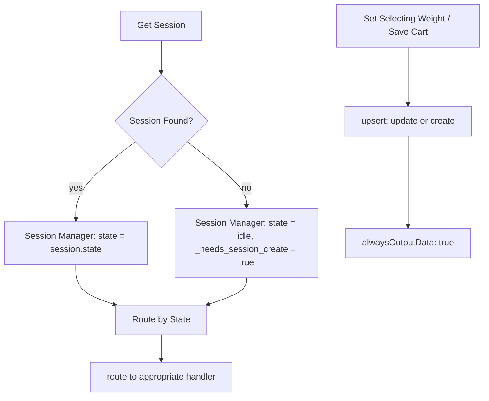

# n8n Workflow Debugging Checklist

Patterns discovered from reviewing real Telegram bot workflows in production. Use when debugging broken flows or auditing existing workflows.

## ۱. DataTable `get` — فیلتر بدون `keyName`

**مشکل:** فیلتر فقط `keyValue` داره ولی `keyName` نداره → DataTable نمی‌تونه جستجو کنه → 0 items برمی‌گردونه.

```json
// ❌ غلط — keyName نداره
"filters": { "conditions": [{ "keyValue": "={{ $json.callback_data.replace('view_product_', '') }}" }] }

// ✅ درست — keyName مشخصه
"filters": { "conditions": [{ "keyName": "id", "keyValue": "={{ $json.callback_data.replace('view_product_', '') }}" }] }
```

**تشخیص:** اگه DataTable `get` هیچوقت داده برنمی‌گردونه ولی مطمئنی ردیف وجود داره، اول `keyName` رو چک کن.

---

## ۲. HTTP Request — `bodyParameters` بدون `name`

**مشکل:** هر parameter باید فیلد `name` داشته باشه. بدون `name`، API نمی‌فهمه هر مقدار چیه → `400 Bad Request`.

```json
// ❌ غلط — فقط value
{ "value": "={{ $('Extract Input Data').first().json.chat_id }}" }

// ✅ درست — name + value
{ "name": "chat_id", "value": "={{ $('Extract Input Data').first().json.chat_id }}" }
```

---

## ۳. Switch node — خروجی‌ها اشتباه روت شدن

**مشکل:** وقتی یه Code/If node می‌خواد بین دو مسیر سوییچ کنه (مثلاً stock error vs stock OK)، ولی خروجی‌ها به هر دو نود destination وصلن به **یک** output index → هر دو مسیر همزمان اجرا می‌شن.

```
Stock Available (Code) [output 0] → Stock Error, Build Cart   ← ❌ هر دو!
Stock Available (Code) [output 0] → Build Cart                ← ✅ فقط stock OK
```

**راه‌حل:** اگه Code node filter-based output می‌خوای، باید Switch node جدا بزنی یا از `If` node استفاده کنی. Code node direct return فقط یه output داره — نمی‌تونی conditionally route کنی.

---

## ۴. Route Callback — callback_data بدون مسیر

**مشکل:** دکمه‌ای با `callback_data` خاصی وجود داره ولی Switch node هیچ condition براش نداره → fallback می‌خوره یا هیچ اتفاقی نمی‌فته.

**تشخیص:**
1. همه callback_data‌های دکمه‌ها رو از نودهای Telegram extract کن
2. شرایط Switch node Route Callback رو list کن
3. ببین کدوم callback_data‌ها مسیر ندارن

**مثال:** `checkout`, `clear_cart`, `confirm_order` مسیر نداشتن → کل checkout flow غیرقابل دسترسی بود.

---

## ۵. DataTable update — `alwaysOutputData` برای downstream

**مشکل:** DataTable update ممکنه خروجی نده (وقتی ردیف پیدا نمی‌کنه یا update خالیه). نود بعدی skip می‌شه بدون خطا.

**راه‌حل:** `alwaysOutputData: true` روی DataTable بذار:
```json
{ "type": "setNodeSettings", "nodeName": "Save Cart",
  "settings": { "alwaysOutputData": true } }
```

---

## ۷. Session-not-found: DataTable `update` روی ردیف وجود نداره

**مشکل:** وقتی DataTable `update` با فیلتر `telegram_id = X` اجرا می‌شه ولی ردیفی با اون `telegram_id` وجود نداره (کاربر جدید یا session پاک شده)، `update` ۰ ردیف برمی‌گردونه و **هیچ خطایی نمیده**. نودهای downstream هرگز اجرا نمی‌شن.

**تشخیص:**
- از `get_execution(executionId, includeData=true)` استفاده کن
- ببین کدوم نود `lastNodeExecuted` هست
- `Get Session` رو ببین: اگه `json: {}` برگردونده (= session وجود نداره) و `_needs_session_create: true` توی Session Manager هست، مشکل session-not-found است
- نودهای بعدی `Set Selecting Weight`, `Save Cart`, `Save Welcome mid` که از `operation: "update"` استفاده می‌کنن هیچ تأثیری ندارن

**رفع:** همه DataTable nodeهایی که سشن رو آپدیت می‌کنن به `operation: "upsert"` با `resource: "row"` تغییر بده:

```json
// BEFORE — update روی ردیف وجود نداره → بدون اثر
{ "operation": "update", "filters": {...} }

// AFTER — upsert: update if exists, create if not
{
  "resource": "row",
  "operation": "upsert",
  "filters": { "conditions": [{ "keyName": "telegram_id", "keyValue": "={{ chat_id }}" }] },
  "matchType": "allConditions",
  "columns": { "mappingMode": "defineBelow", "value": { "state": "selecting_weight", ... } }
}
```

**الگوی session management صحیح:**


> **همه نودهایی که سشن رو تغییر می‌دن باید `upsert` باشن، نه `update`.** `Save Welcome mid`, `Set Selecting Weight`, `Save Cart`, `Save Address`, `Cancel Checkout`, `Clear Cart Reset`, `Reset State to Idle`

---

## ۸. `weight_` prefix در Route Callback به عنوان fallback

**مشکل:** دکمه‌های وزن (`weight_1_250`) وقتی state=idle به Route Callback می‌رسن ولی هیچ condition `weight_` prefix ندارن → fallback می‌خورن و drop می‌شن.

**رفع:** یه condition `startsWith "weight_"` به Route Callback اضافه کن که مستقیم به `Weight Handler` وصل بشه — safety net برای وقتی که session state از دست رفته.

---

## ۹. DataTable operation: `upsert` نیاز به `resource: "row"` داره

> DataTable node دو تا resource داره: `row` و `table`. `upsert`, `insert`, `get`, `update`, `deleteRows` همگی زیر `resource: "row"` هستن.

```json
// ❌ غلط — بدون resource، upsert کار نمی‌کنه
{ "operation": "upsert", ... }

// ✅ درست
{ "resource": "row", "operation": "upsert", ... }
```

`operation: "create"` وجود نداره. اسم درست `insert` هست.

**مشکل:** نود خروجی داره ولی هیچ connection‌ای ازش نمیره. مسیر workflow قطع می‌شه بدون خطا.

**تشخیص:** connections map رو بخون — ببین کدوم نودها اسمشون توی keys هست ولی target ندارن یا target null/empty هست.